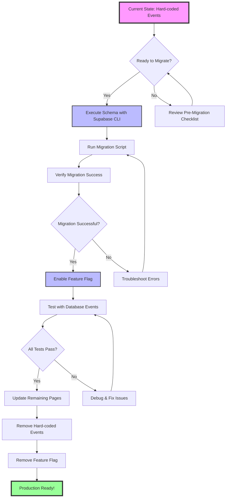

# Supabase Events Migration Flow



## Current Position: 🔷 Ready to Execute Schema (Step C)

## Quick Command Flow

1. **Execute Schema** (Step C)
   ```bash
   ./scripts/supabase-cli-migration.sh
   ```

2. **Run Migration** (Step E)
   ```bash
   npm run migrate:events
   ```

3. **Verify Migration** (Step F)
   ```bash
   npm run verify:events
   ```

4. **Enable Feature Flag** (Step H)
   ```bash
   echo "NEXT_PUBLIC_USE_EVENTS_SCHEMA=true" >> .env.local
   ```

5. **Test Events** (Step J)
   ```bash
   npm run dev
   # Visit http://localhost:3000/test-events
   ```

## File Structure

```
/
├── .development/events-supabase/
│   ├── 01-events-schema-definition.sql    # Schema to execute
│   ├── 02-seed-events-schema.ts          # Seed script (optional)
│   ├── 03-events-schema-service.ts       # Service for new schema
│   ├── migration-checklist.md            # Detailed checklist
│   ├── migration-flow.md                 # This flow diagram
│   └── supabase-cli-instructions.md      # CLI instructions
│
├── scripts/
│   ├── supabase-cli-migration.sh         # Main execution script
│   ├── migrate-events-to-supabase.ts     # Data migration script
│   └── verify-events-migration.ts        # Verification script
│
├── lib/
│   ├── event-facade.ts                   # Gradual migration interface
│   └── event-utils.ts                    # Hard-coded events (to remove)
│
└── app/
    └── test-events/
        └── page.tsx                      # Test page for verification
```

## Decision Points

1. **Pre-Migration**: Ensure all environment variables are set
2. **Post-Schema**: Verify tables created in events schema
3. **Post-Migration**: Check all events migrated correctly
4. **Feature Flag**: Test thoroughly before full rollout
5. **Production**: Remove flag once stable

## Rollback Strategy

If issues occur at any stage:
```bash
# 1. Disable feature flag
sed -i '' 's/NEXT_PUBLIC_USE_EVENTS_SCHEMA=true/NEXT_PUBLIC_USE_EVENTS_SCHEMA=false/' .env.local

# 2. Restart application
npm run dev

# 3. (Optional) Drop schema if needed
supabase db execute --sql "DROP SCHEMA IF EXISTS events CASCADE;"
```

The application will automatically revert to using hard-coded events.