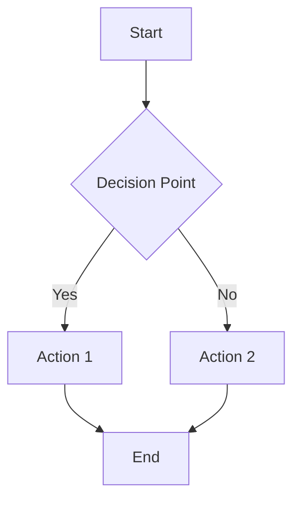

# SOP-000: Template Standard Operating Procedure

> This is a template for creating new SOPs. Copy this file and rename it to SOP-XXX-[Your-Title].md

## Purpose
[Clearly state why this SOP exists and what problem it solves]

## Scope
This SOP applies to:
- [Specific area 1]
- [Specific area 2]
- [Specific area 3]

This SOP does NOT cover:
- [Exclusion 1]
- [Exclusion 2]

## Prerequisites
Before starting this process:
- [ ] [Requirement 1]
- [ ] [Requirement 2]
- [ ] [Access/permission needed]

## Process

### Step 1: [First Major Action]

#### 1.1 [Sub-action Name]
Description of what to do:
1. First specific instruction
2. Second specific instruction
3. Third specific instruction

**Example:**
```
[Code or command example if applicable]
```

#### 1.2 [Second Sub-action]
- [ ] Checklist item 1
- [ ] Checklist item 2
- [ ] Checklist item 3

### Step 2: [Second Major Action]

#### 2.1 [Sub-action Name]
Decision point:
```
IF [condition] THEN
    → Go to Step 2.2
ELSE
    → Go to Step 3
```

#### 2.2 [Alternative Path]
[Instructions for alternative path]

### Step 3: [Final Action]

#### 3.1 [Validation]
Verify completion:
- [ ] Success criteria 1 met
- [ ] Success criteria 2 met
- [ ] Documentation updated

## Templates and Examples

### Template 1: [Name]
```markdown
[Template content]
```

### Example 1: [Scenario Name]
```
[Concrete example showing the process]
```

## Common Issues and Solutions

### Issue 1: [Problem Description]
**Symptoms:** [What you'll see]
**Cause:** [Why it happens]
**Solution:** [How to fix it]

### Issue 2: [Problem Description]
**Symptoms:** [What you'll see]
**Cause:** [Why it happens]
**Solution:** [How to fix it]

## Decision Matrix

| Situation | Action | Reason |
|-----------|--------|--------|
| [Scenario 1] | [Do X] | [Because Y] |
| [Scenario 2] | [Do A] | [Because B] |

## Flowchart


## Key Metrics
Track these metrics to measure success:
- [Metric 1]: [Target value]
- [Metric 2]: [Target value]
- [Metric 3]: [Target value]

## Tooling
Required tools:
- [Tool 1]: [Purpose]
- [Tool 2]: [Purpose]

Optional tools:
- [Tool 3]: [When to use]

## Security Considerations
- [ ] [Security check 1]
- [ ] [Security check 2]
- [ ] [Compliance requirement]

## Related Documents
- [Related SOP 1]
- [Related Law/Pattern]
- [External documentation]

## Change Log
| Version | Date | Author | Changes |
|---------|------|--------|---------|
| 1.0 | YYYY-MM-DD | [Name] | Initial version |
| 1.1 | YYYY-MM-DD | [Name] | [What changed] |

## Accountability
- **Owner**: [Role/Name]
- **Reviewers**: [Roles/Names]
- **Approvers**: [Roles/Names]
- **Update Frequency**: [How often reviewed]
- **Last Updated**: [Date]
- **Next Review**: [Date]

## Appendices

### Appendix A: [Additional Information]
[Detailed reference information]

### Appendix B: [Glossary]
- **Term 1**: Definition
- **Term 2**: Definition

## Emergency Contacts
For urgent issues:
- **Primary**: [Name] - [Contact]
- **Secondary**: [Name] - [Contact]
- **Escalation**: [Name] - [Contact]