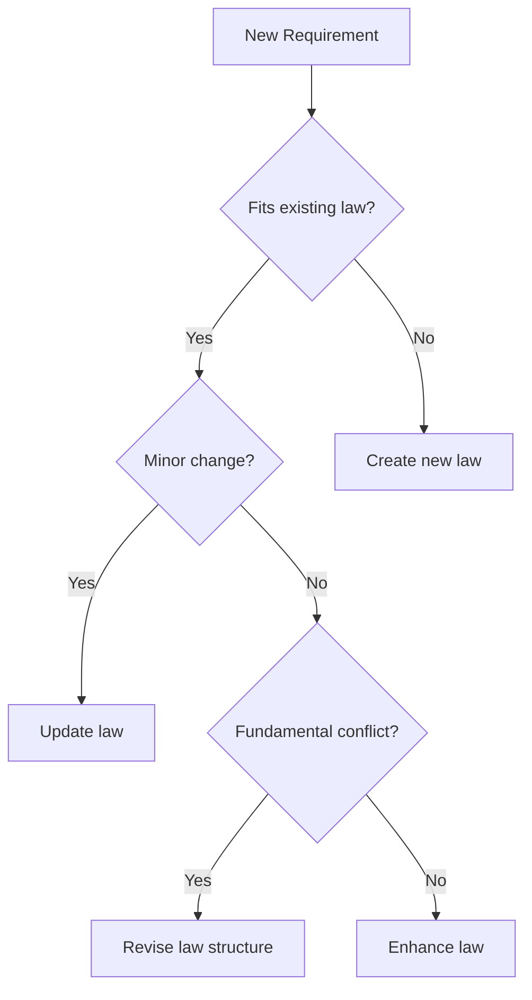

# SOP-002: Law Integration Process

## Purpose
This SOP defines how to integrate new architectural requirements, patterns, or technologies into the existing law framework when adopting new tools, libraries, or practices.

## Scope
This process covers:
- Integrating new technology requirements (e.g., new state management library)
- Adding framework-specific patterns (e.g., Next.js updates)
- Incorporating security or performance requirements
- Adopting industry best practices

## Process

### Step 1: Technology Assessment

#### 1.1 Document the New Requirement
```markdown
Technology: [Name]
Version: [X.X.X]
Purpose: [Why we need this]
Impact Areas: [Which laws/patterns affected]
```

#### 1.2 Compatibility Check
- [ ] Compatible with existing laws?
- [ ] Requires law modifications?
- [ ] Creates law conflicts?
- [ ] Needs new law creation?

### Step 2: Gap Analysis

#### 2.1 Current State Mapping
Review existing laws for:
1. Direct conflicts
2. Enhancement opportunities
3. Gap areas
4. Deprecation needs

#### 2.2 Future State Design
Create plan for:
1. Laws to modify
2. Laws to add
3. Laws to deprecate
4. Patterns to update

### Step 3: Integration Planning

#### 3.1 Modification Matrix
| Law/Pattern | Change Type | Description | Priority |
|-------------|-------------|-------------|----------|
| Law 5 | Enhance | Add new type requirements | High |
| Pattern 08 | Update | Include new examples | Medium |
| Law X | Create | New security law | High |

#### 3.2 Implementation Sequence
1. Update conflicting laws first
2. Enhance existing laws
3. Create new laws
4. Update patterns
5. Revise guides

### Step 4: Documentation Updates

#### 4.1 Law Modifications
For each modified law:
```markdown
### Law X: [Title] (Updated)
- [Existing requirement]
- [New requirement for technology] **[NEW]**
- [Modified requirement] **[UPDATED]**
- See [Technology-Specific Pattern] for details
```

#### 4.2 Pattern Creation
Create pattern files:
- `XX-[technology]-patterns.md`
- `XX-[technology]-integration-guide.md`

### Step 5: Validation

#### 5.1 Consistency Check
- [ ] No contradictions between laws
- [ ] Clear precedence when conflicts exist
- [ ] All examples updated
- [ ] References are current

#### 5.2 Completeness Check
- [ ] All use cases covered
- [ ] Migration path defined
- [ ] Rollback plan exists
- [ ] Training materials ready

### Step 6: Rollout

#### 6.1 Communication Plan
1. Team announcement
2. Change summary document
3. Training sessions
4. Q&A period

#### 6.2 Phased Implementation
- Phase 1: New code follows updated laws
- Phase 2: Critical paths updated
- Phase 3: Full codebase compliance
- Phase 4: Tooling enforcement

## Examples

### Example 1: Integrating Zustand State Management

#### Assessment
```markdown
Technology: Zustand
Version: 4.0.0
Purpose: Replace Context API for client state
Impact Areas: Law 7 (Separation of Concerns), Pattern 06 (State Management)
```

#### Integration
1. Modify Law 7 to include Zustand patterns
2. Update state management patterns
3. Create Zustand-specific examples
4. Add migration guide from Context

### Example 2: Adopting Next.js App Router

#### Assessment
```markdown
Technology: Next.js App Router
Version: 13+
Purpose: New routing paradigm
Impact Areas: Laws 1, 2, 4, 6 (multiple laws affected)
```

#### Integration
1. Major law updates required
2. New patterns for server components
3. Deprecate pages directory patterns
4. Comprehensive migration guide

## Decision Framework

### When to Modify vs Create Laws



## Templates

### Technology Integration Summary
```markdown
# [Technology] Integration Summary

## Overview
- Technology: [Name]
- Version: [X.X.X]
- Integration Date: [Date]
- Lead: [Name]

## Law Changes
### Modified Laws
- Law X: [Change description]
- Law Y: [Change description]

### New Laws
- Law Z: [Purpose]

### Deprecated Elements
- Pattern A: [Reason]

## Migration Guide
[Step-by-step migration]

## Timeline
- Phase 1: [Date] - [Milestone]
- Phase 2: [Date] - [Milestone]
```

## Risk Management

### Common Risks
1. **Breaking Changes**: Existing code violations
2. **Conflicts**: Contradictory requirements
3. **Complexity**: Over-complicated laws
4. **Adoption**: Team resistance

### Mitigation Strategies
1. Gradual rollout with phases
2. Clear conflict resolution rules
3. Simplification reviews
4. Team involvement in planning

## Metrics

### Success Indicators
- Adoption rate: >90% in new code within 30 days
- Violation rate: <5% in code reviews
- Migration completion: 100% within timeline
- Team satisfaction: Positive feedback

### Tracking
- Weekly violation reports
- Migration progress dashboard
- Team feedback surveys
- Performance impact analysis

## Accountability

- **Owner**: Architecture Team Lead
- **Reviewers**: Senior Developers, Tech Leads
- **Approvers**: CTO, Engineering Manager
- **Update Frequency**: Per major technology adoption

## Related Documents

- [SOP-001-How-To-Write-Laws.md](./SOP-001-How-To-Write-Laws.md)
- [01-immutable-architecture-laws.md](./01-immutable-architecture-laws.md)
- [11-application-of-laws.md](./11-application-of-laws.md)