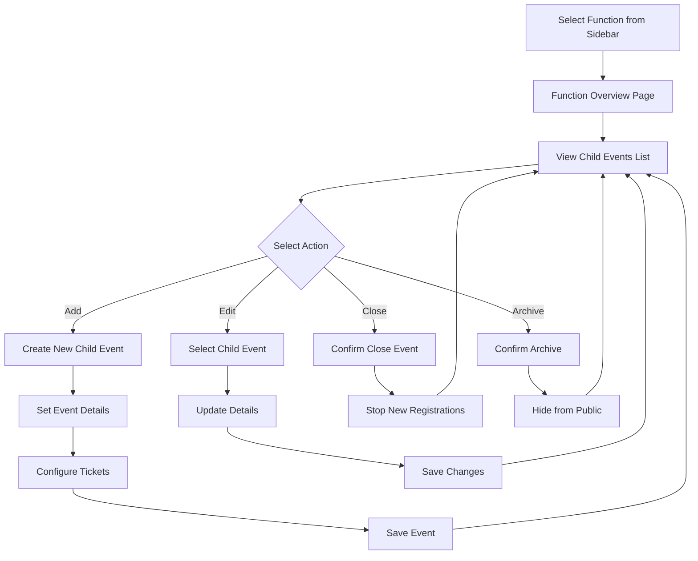
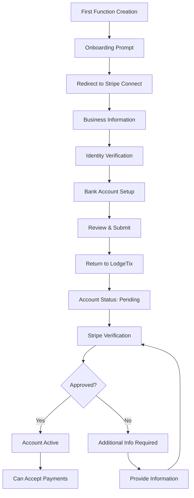
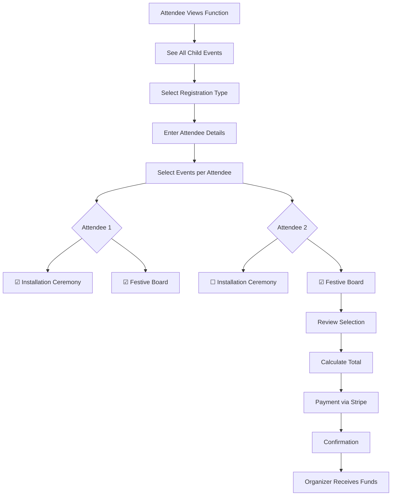
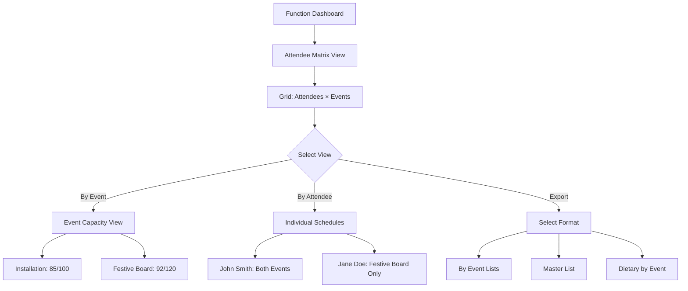
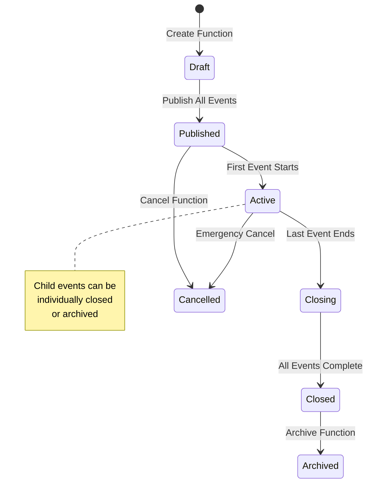
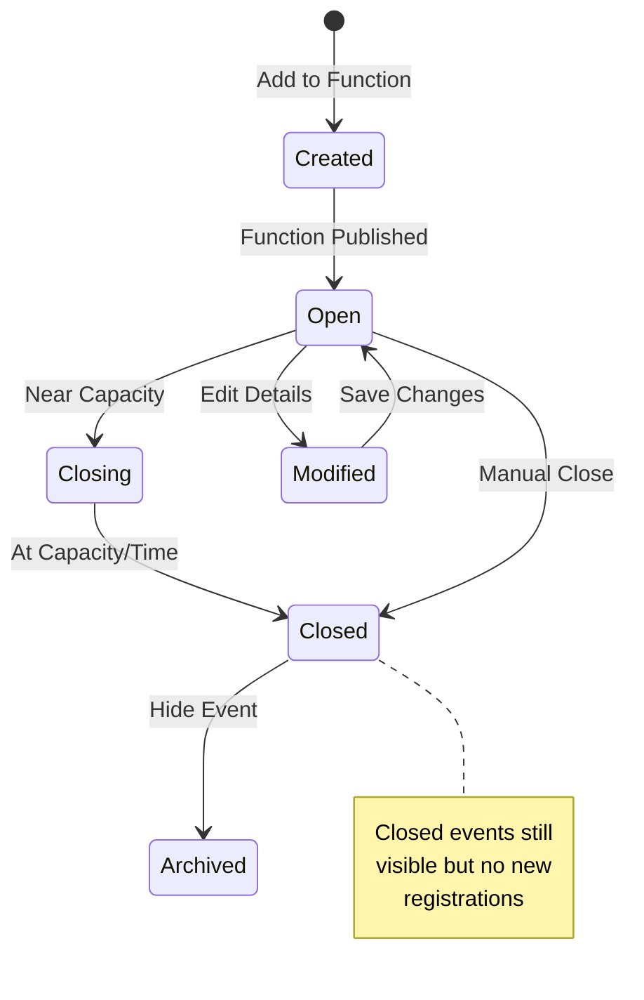
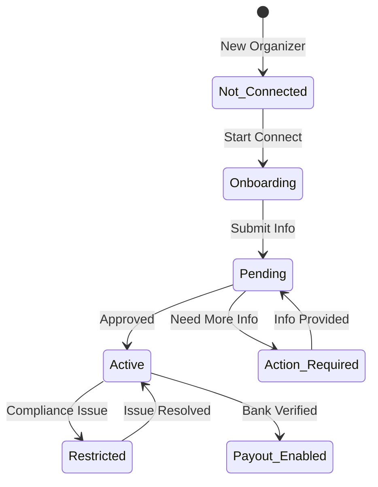
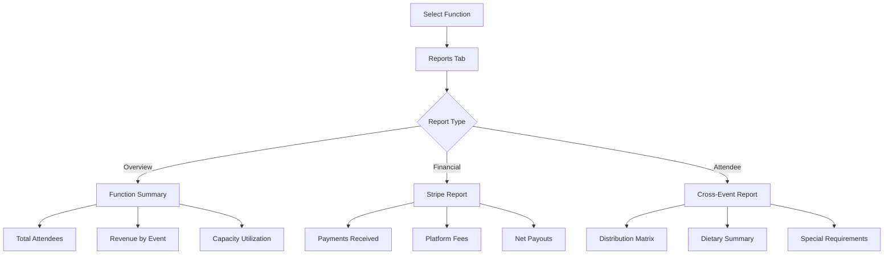

# User Stories and Detailed Workflows (v2)
## Organizer Portal - Hierarchical Events with Stripe Connect

---

## 1. User Stories - Hierarchical Event System

### 1.1 Function Creation and Management

#### STORY-001: Host a Function
**As an** event organizer  
**I want to** host a function with multiple child events  
**So that** I can manage related events together  

**Acceptance Criteria:**
- Can create a parent function with name, dates, description
- Can add multiple child events within the function
- Each child event has its own timing and capacity
- Can save as draft and return later
- Function gets a unique URL for all child events
- System validates no date conflicts

#### STORY-002: Stripe Connect Onboarding
**As an** event organizer  
**I want to** connect my bank account via Stripe  
**So that** I can receive payments directly  

**Acceptance Criteria:**
- One-time onboarding when creating first function
- Redirects to Stripe Connect Express
- Returns to LodgeTix after completion
- Shows connection status in dashboard
- Can update bank details anytime
- Platform fees clearly displayed

#### STORY-003: Manage Child Events
**As an** event organizer  
**I want to** create, update, close, and archive child events  
**So that** I can adapt to changing requirements  

**Acceptance Criteria:**
- Can add new child events to existing function
- Can edit event details (time, location, capacity)
- Can close events to stop new registrations
- Can archive events to hide from public
- Changes don't affect existing registrations
- Maintains event order/hierarchy

#### STORY-004: Configure Event Tickets
**As an** event organizer  
**I want to** set up tickets for each child event  
**So that** attendees can register for specific events  

**Acceptance Criteria:**
- Create ticket types per child event
- Set different prices for Mason/Guest
- Define eligibility rules
- Set inventory limits
- Can offer package deals across events
- Early bird pricing with dates

### 1.2 Registration Management

#### STORY-005: View Function Registrations
**As an** event organizer  
**I want to** see all registrations for my function  
**So that** I can track overall attendance  

**Acceptance Criteria:**
- See registration list at function level
- View which events each attendee selected
- Filter by registration status
- See payment status via Stripe
- Shows total revenue collected
- Export complete attendee list

#### STORY-006: Manage Cross-Event Attendees
**As an** event organizer  
**I want to** see attendee distribution across child events  
**So that** I can manage capacity and logistics  

**Acceptance Criteria:**
- Visual grid showing attendees × events
- Capacity indicators per event
- Can move attendees between events
- Waitlist management per event
- Dietary requirements by event
- Seating coordination tools

### 1.3 Financial Management

#### STORY-007: Track Stripe Payments
**As an** event organizer  
**I want to** see my payments and payouts  
**So that** I can manage my finances  

**Acceptance Criteria:**
- View all payments in dashboard
- See platform fees deducted
- Track payout schedule
- Download tax reports
- Handle refunds directly
- View dispute status

#### STORY-008: Financial Reporting
**As an** event organizer  
**I want to** generate financial reports for my function  
**So that** I can report to my lodge  

**Acceptance Criteria:**
- Revenue breakdown by child event
- Payment method analysis
- Refund tracking
- Fee calculations
- Export to accounting format
- Historical comparisons

### 1.4 Communication

#### STORY-009: Email by Event
**As an** event organizer  
**I want to** email attendees of specific child events  
**So that** I can send targeted communications  

**Acceptance Criteria:**
- Select one or more child events
- Compose email with templates
- Use merge fields
- Schedule sending
- Track delivery
- Manage bounces

---

## 2. Detailed User Workflows - Hierarchical System

### 2.1 Complete Function Setup Workflow

```mermaid
flowchart TD
    A[Login to Organizer Portal] --> B{Stripe Connected?}
    B -->|No| C[Stripe Connect Onboarding]
    B -->|Yes| D[Dashboard with Sidebar]
    C --> D
    D --> E[Click "Host a Function"]
    E --> F[EventCreationWizard Starts]
    F --> G[Step 1: Function Details]
    G --> H[Step 2: Add Child Events]
    H --> I{Add Another Event?}
    I -->|Yes| H
    I -->|No| J[Step 3: Configure Tickets]
    J --> K[Select Child Event]
    K --> L[Add Ticket Types]
    L --> M{More Events?}
    M -->|Yes| K
    M -->|No| N[Step 4: Review Structure]
    N --> O{Ready to Publish?}
    O -->|No| P[Save as Draft]
    O -->|Yes| Q[Publish Function]
    P --> R[Return to Dashboard]
    Q --> R
```

### 2.2 Child Event Management Workflow



### 2.3 Stripe Connect Onboarding Flow



### 2.4 Registration Flow with Child Events



### 2.5 Cross-Event Attendee Management



---

## 3. State Diagrams - Hierarchical System

### 3.1 Function Lifecycle States



### 3.2 Child Event States



### 3.3 Stripe Connect Account States



---

## 4. Error Handling Workflows

### 4.1 Stripe Connection Failures

1. **Verification Failed**
   - Show specific requirements
   - Provide direct link to fix
   - Allow manual verification
   - Support contact option

2. **Payout Failures**
   - Alert in dashboard
   - Email notification
   - Bank detail update flow
   - Manual payout request

### 4.2 Capacity Conflicts

1. **Child Event Oversold**
   - Automatic waitlist
   - Notify organizer
   - Suggest solutions
   - Transfer options

2. **Venue Capacity Exceeded**
   - Warning before save
   - Show current bookings
   - Suggest alternatives
   - Split event option

---

## 5. Integration Workflows

### 5.1 Stripe Webhooks
```
Stripe Event → Webhook Endpoint → Process Event → Update Database → Notify Organizer

Events:
- payment_intent.succeeded → Mark registration paid
- charge.refunded → Update registration status
- account.updated → Sync organizer status
- payout.created → Track in dashboard
```

### 5.2 Email Notifications
```
Function Event → Check Preferences → Generate Email → Send via Service → Track Delivery

Triggers:
- New registration
- Payment received
- Event capacity warning
- Payout processed
- Child event changes
```

---

## 6. Mobile Workflows

### 6.1 Mobile Sidebar Navigation
- Hamburger menu activation
- Slide-out navigation
- Function quick access
- Collapsed by default
- Touch-optimized controls

### 6.2 Mobile Function Management
- Simplified child event list
- Swipe actions (edit/close)
- Quick stats cards
- Essential actions only
- Full version link

---

## 7. Reporting Workflows

### 7.1 Function-Wide Reports


### 7.2 Comparative Analysis
- Compare child events within function
- Year-over-year function comparison
- Revenue optimization insights
- Attendance pattern analysis

---

## 8. Advanced Features

### 8.1 Function Templates
1. Save successful function as template
2. Include all child events and tickets
3. Quick duplicate for next year
4. Modify dates and details
5. Maintain pricing structure

### 8.2 Attendee Flow Management
1. Track attendee movement between events
2. Coordinate timing for smooth transitions
3. Manage shared resources (parking, catering)
4. Generate logistics reports
5. Communication by attendee schedule

---

## 9. Security Workflows

### 9.1 Financial Security
- All payments through Stripe Connect
- No card details stored in LodgeTix
- Encrypted organizer banking info
- Two-factor for withdrawals
- Audit trail for all transactions

### 9.2 Data Access Control
- Function-level permissions
- Can't see other organizers' data
- Granular access for assistants
- Time-based access for contractors
- Activity logging for compliance

---

## 10. Support Workflows

### 10.1 In-App Assistance
- Contextual help tooltips
- Video tutorials in wizard
- Common issues FAQ
- Direct support chat
- Community forum access

### 10.2 Stripe Support Escalation
- Platform handles Level 1
- Stripe Connect for payments
- Integrated ticket system
- Priority support for large functions
- Dedicated success manager (enterprise)