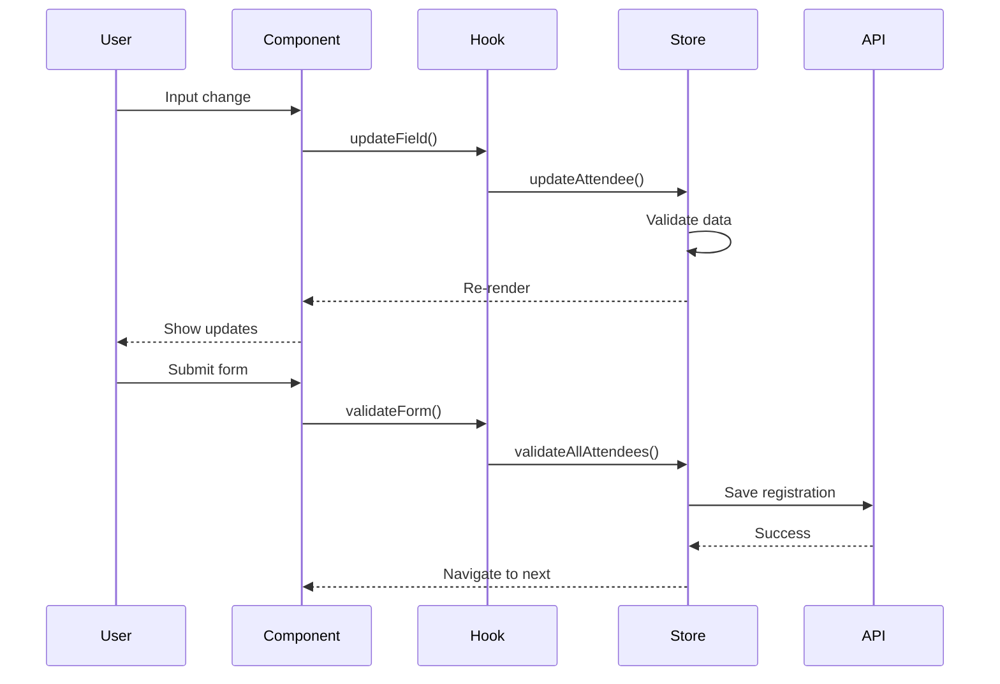
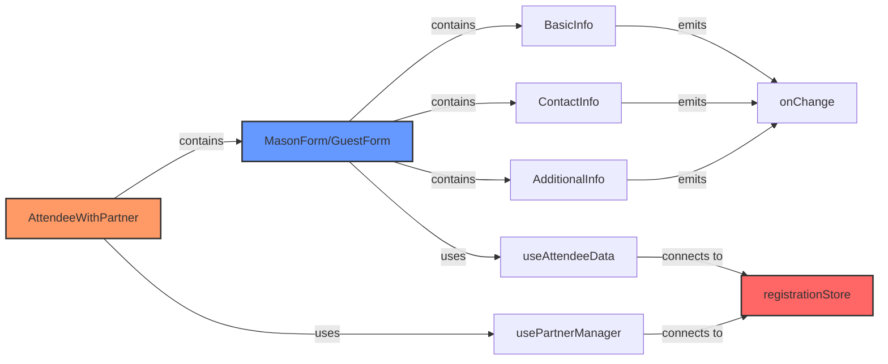

# Task 134: Update Documentation

## Objective
Update all documentation to reflect the new forms architecture, including README files, code comments, and architecture diagrams.

## Dependencies
- All refactoring complete
- New architecture stable

## Steps

1. Update main forms README:
```markdown
# components/register/forms/README.md

# Registration Forms Architecture

This directory contains the refactored registration forms system for LodgeTix. The architecture follows a component-based approach with clear separation of concerns.

## Architecture Overview

```
forms/
├── attendee/           # Core attendee logic and containers
├── basic-details/      # Shared form sections
├── guest/             # Guest-specific components
├── mason/             # Mason-specific components
└── shared/            # Shared UI components
```

## Key Concepts

### 1. Attendee Types
- **Mason**: Lodge members with additional fields (rank, lodge info)
- **Guest**: Non-mason attendees with basic information

### 2. Component Hierarchy
1. **Container Layouts**: Orchestrate form composition (`AttendeeWithPartner`)
2. **Form Layouts**: Type-specific forms (`MasonForm`, `GuestForm`)
3. **Form Sections**: Reusable field groups (`BasicInfo`, `ContactInfo`)
4. **Field Components**: Individual form fields

### 3. State Management
- Global state: Zustand store (`registrationStore`)
- Local state: React hooks for UI behavior
- Form state: Managed through custom hooks

## Usage Examples

### Basic Mason Registration
```typescript
import { MasonForm } from '@/components/register/forms/mason/layouts/MasonForm';

<MasonForm
  attendeeId="mason-123"
  attendeeNumber={1}
  isPrimary={true}
/>
```

### Attendee with Partner
```typescript
import { AttendeeWithPartner } from '@/components/register/forms/attendee/AttendeeWithPartner';

<AttendeeWithPartner
  attendeeId="attendee-123"
  attendeeNumber={1}
  isPrimary={true}
  allowPartner={true}
/>
```

## Development Guide

### Adding a New Attendee Type
1. Create type-specific directory under `forms/`
2. Implement form layout component
3. Add type to `AttendeeData` interface
4. Update `attendeeTypeRenderer` utility

### Creating Form Sections
1. Add component to `basic-details/` or type-specific directory
2. Implement `SectionProps` interface
3. Handle validation and field updates
4. Export from appropriate index file

### Business Logic
All business logic should be placed in:
- `attendee/utils/businessLogic.ts` - Form behavior rules
- `attendee/utils/validation.ts` - Field validation
- `attendee/utils/constants.ts` - Domain constants

## Testing

Run tests:
```bash
npm run test:forms
```

Test coverage:
```bash
npm run test:coverage -- components/register/forms
```

## Migration from Old Forms

See `MIGRATION.md` for details on migrating from the old forms system.
```

2. Create migration guide:
```markdown
# components/register/forms/MIGRATION.md

# Migration Guide: Old Forms to New Architecture

This guide helps migrate from the old forms system to the new architecture.

## Import Changes

### Form Components
```typescript
// Old
import { MasonForm } from '@/components/register/oldforms/mason/MasonForm';
// New
import { MasonForm } from '@/components/register/forms/mason/layouts/MasonForm';

// Old
import { GuestForm } from '@/components/register/oldforms/guest/GuestForm';
// New  
import { GuestForm } from '@/components/register/forms/guest/layouts/GuestForm';
```

### Shared Components
```typescript
// Old
import { AutocompleteInput } from '@/components/register/functions/AutocompleteInput';
// New
import { AutocompleteInput } from '@/components/register/forms/shared/AutocompleteInput';
```

### Form Sections
```typescript
// Old (separate components)
import { MasonBasicInfo } from '@/components/register/oldforms/mason/MasonBasicInfo';
import { GuestBasicInfo } from '@/components/register/oldforms/guest/GuestBasicInfo';

// New (unified component)
import { BasicInfo } from '@/components/register/forms/basic-details/BasicInfo';
// Use with type prop:
<BasicInfo type="Mason" ... />
<BasicInfo type="Guest" ... />
```

## API Changes

### Partner Management
```typescript
// Old
addLadyPartnerAttendee(masonId);
addGuestPartnerAttendee(guestId);

// New
addPartnerAttendee(attendeeId); // Works for any attendee type
```

### Form Props
```typescript
// Old
<MasonForm 
  mason={masonData}
  updateMason={updateFunction}
  errors={errors}
/>

// New
<MasonForm
  attendeeId={attendeeId}
  attendeeNumber={1}
  isPrimary={true}
/>
```

## New Features

1. **Unified Partner System**: Partners are always Guests regardless of parent type
2. **Better Validation**: Centralized validation with clear error messages
3. **Type Safety**: Full TypeScript support with proper interfaces
4. **Reusable Sections**: Form sections work across attendee types
5. **Performance**: Debounced updates and optimized re-renders

## Common Patterns

### Using Hooks
```typescript
// Access attendee data
const { attendee, updateField } = useAttendeeData(attendeeId);

// Manage partners
const { partner, togglePartner } = usePartnerManager(attendeeId);

// Form validation
const { errors, validateForm } = useFormValidation(attendeeId);
```

### Container Usage
```typescript
// Old: Separate components for attendee with partner
<MasonWithPartner ... />
<GuestWithPartner ... />

// New: Single container that handles all types
<AttendeeWithPartner
  attendeeId={attendeeId}
  allowPartner={true}
/>
```

## Troubleshooting

### Common Issues

1. **Missing Imports**
   - Run: `npm run migrate:imports`
   - Check for old import paths

2. **Type Errors**
   - Ensure using new `AttendeeData` interface
   - Update prop types to match new components

3. **State Updates**
   - Use `updateField` from hooks instead of direct updates
   - Ensure proper attendee ID is passed

### Getting Help

- Check `components/register/forms/README.md`
- Review component JSDoc comments
- See example implementations in wizard steps
```

3. Update architecture diagram:
```mermaid
# components/register/forms/ARCHITECTURE.md

# Forms Architecture Diagram

```mermaid
graph TD
    A[Registration Wizard] --> B[Registration Type Step]
    B --> C[Attendee Details Step]
    
    C --> D{Registration Type}
    D -->|Individual| E[IndividualsForm]
    D -->|Lodge| F[LodgesForm]
    D -->|Delegation| G[DelegationsForm]
    
    E --> H[AttendeeWithPartner]
    F --> H
    G --> H
    
    H --> I{Attendee Type}
    I -->|Mason| J[MasonForm]
    I -->|Guest| K[GuestForm]
    
    J --> L[Form Sections]
    K --> L
    
    L --> M[BasicInfo]
    L --> N[ContactInfo]
    L --> O[AdditionalInfo]
    L --> P[LodgeSelection]
    L --> Q[GrandOfficerFields]
    
    style A fill:#f9f,stroke:#333,stroke-width:4px
    style H fill:#bbf,stroke:#333,stroke-width:2px
    style L fill:#bfb,stroke:#333,stroke-width:2px
```

## Data Flow



## Component Relationships


```

4. Update JSDoc comments:
```typescript
// Add comprehensive JSDoc to all components

/**
 * BasicInfo Component
 * 
 * Renders personal information fields for both Mason and Guest attendees.
 * Handles title-rank interaction logic for Masons.
 * 
 * @component
 * @example
 * ```tsx
 * <BasicInfo
 *   data={attendeeData}
 *   type="Mason"
 *   isPrimary={true}
 *   onChange={(field, value) => updateField(field, value)}
 * />
 * ```
 * 
 * @param {Object} props - Component props
 * @param {AttendeeData} props.data - Attendee data object
 * @param {'Mason' | 'Guest'} props.type - Attendee type
 * @param {boolean} [props.isPrimary] - Whether this is the primary attendee
 * @param {Function} props.onChange - Callback for field changes
 * 
 * @returns {JSX.Element} Rendered component
 */
export const BasicInfo: React.FC<SectionProps> = ({ /* ... */ }) => {
  // Implementation
};
```

5. Create API documentation:
```typescript
// components/register/forms/API.md

# Forms API Reference

## Hooks

### useAttendeeData
```typescript
const { attendee, updateField, updateMultipleFields, deleteAttendee } = useAttendeeData(attendeeId: string);
```

**Parameters:**
- `attendeeId`: Unique identifier for the attendee

**Returns:**
- `attendee`: Current attendee data
- `updateField`: Update single field
- `updateMultipleFields`: Update multiple fields
- `deleteAttendee`: Remove attendee

### usePartnerManager
```typescript
const { attendee, partner, hasPartner, togglePartner } = usePartnerManager(attendeeId: string);
```

**Parameters:**
- `attendeeId`: ID of the parent attendee

**Returns:**
- `attendee`: Parent attendee data
- `partner`: Partner attendee data (if exists)
- `hasPartner`: Boolean flag
- `togglePartner`: Add/remove partner

### useFormValidation
```typescript
const { errors, validateForm, validateField, getFieldError } = useFormValidation(attendeeId: string);
```

**Parameters:**
- `attendeeId`: Attendee to validate

**Returns:**
- `errors`: Current validation errors
- `validateForm`: Validate entire form
- `validateField`: Validate single field
- `getFieldError`: Get error for specific field

## Components

### AttendeeWithPartner
Main container for attendee forms with optional partner.

**Props:**
- `attendeeId`: string
- `attendeeNumber`: number
- `isPrimary?`: boolean
- `allowPartner?`: boolean

### MasonForm
Form layout for Mason attendees.

**Props:**
- `attendeeId`: string
- `attendeeNumber`: number
- `isPrimary?`: boolean

### GuestForm  
Form layout for Guest attendees.

**Props:**
- `attendeeId`: string
- `attendeeNumber`: number
- `isPrimary?`: boolean

## Utilities

### Validation Functions
- `validateEmail(email: string): boolean`
- `validatePhone(phone: string): boolean`
- `validateAttendee(attendee: AttendeeData): ValidationResult`

### Business Logic
- `handleTitleChange(title: string, currentRank: string): object`
- `shouldShowGrandOfficerFields(attendee: AttendeeData): boolean`
- `getRequiredFields(attendee: AttendeeData): string[]`

### Formatters
- `formatPhoneNumber(phone: string): string`
- `formatName(name: string): string`
- `formatLodgeDisplay(name: string, number: string): string`
```

6. Update Storybook stories:
```typescript
// components/register/forms/stories/BasicInfo.stories.tsx
import type { Meta, StoryObj } from '@storybook/react';
import { BasicInfo } from '../basic-details/BasicInfo';

const meta: Meta<typeof BasicInfo> = {
  title: 'Forms/BasicInfo',
  component: BasicInfo,
  parameters: {
    layout: 'centered',
  },
  argTypes: {
    type: {
      control: 'select',
      options: ['Mason', 'Guest'],
    },
  },
};

export default meta;
type Story = StoryObj<typeof meta>;

export const MasonPrimary: Story = {
  args: {
    data: {
      attendeeId: '123',
      attendeeType: 'Mason',
      title: 'Bro',
      firstName: 'John',
      lastName: 'Doe',
      rank: 'MM',
      isPrimary: true,
    },
    type: 'Mason',
    isPrimary: true,
    onChange: (field, value) => console.log(field, value),
  },
};

export const GuestSecondary: Story = {
  args: {
    data: {
      attendeeId: '456',
      attendeeType: 'Guest',
      title: 'Mr',
      firstName: 'Jane',
      lastName: 'Doe',
      isPrimary: false,
    },
    type: 'Guest',
    isPrimary: false,
    onChange: (field, value) => console.log(field, value),
  },
};
```

## Deliverables
- Updated README files
- Migration guide
- Architecture diagrams
- API documentation
- JSDoc comments
- Storybook stories

## Success Criteria
- Documentation is comprehensive
- Examples are clear and working
- Migration path is obvious
- API is well documented
- Diagrams are accurate