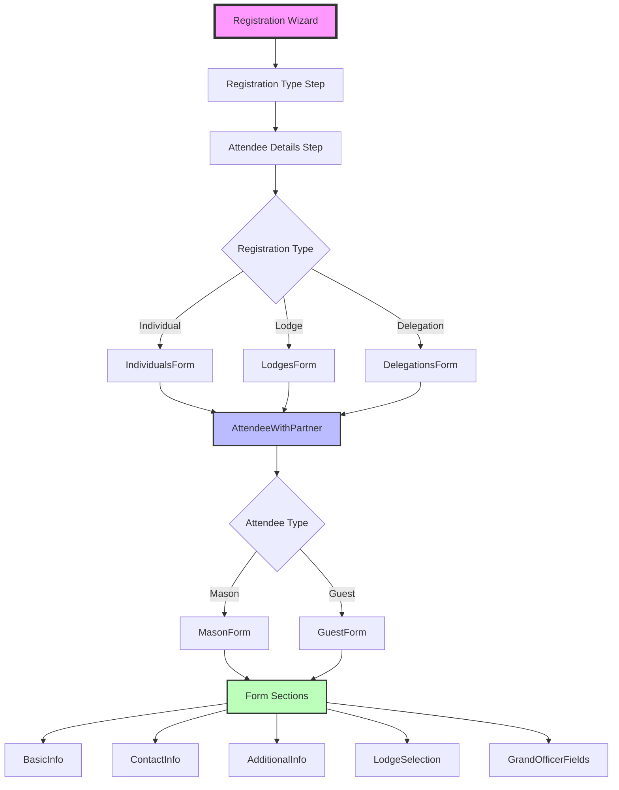
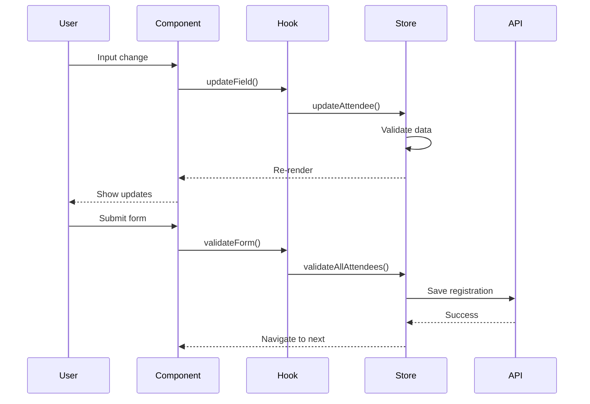
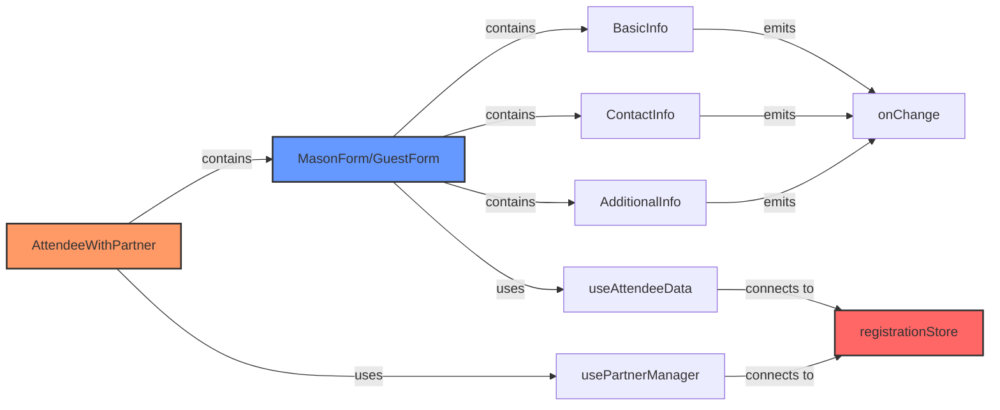
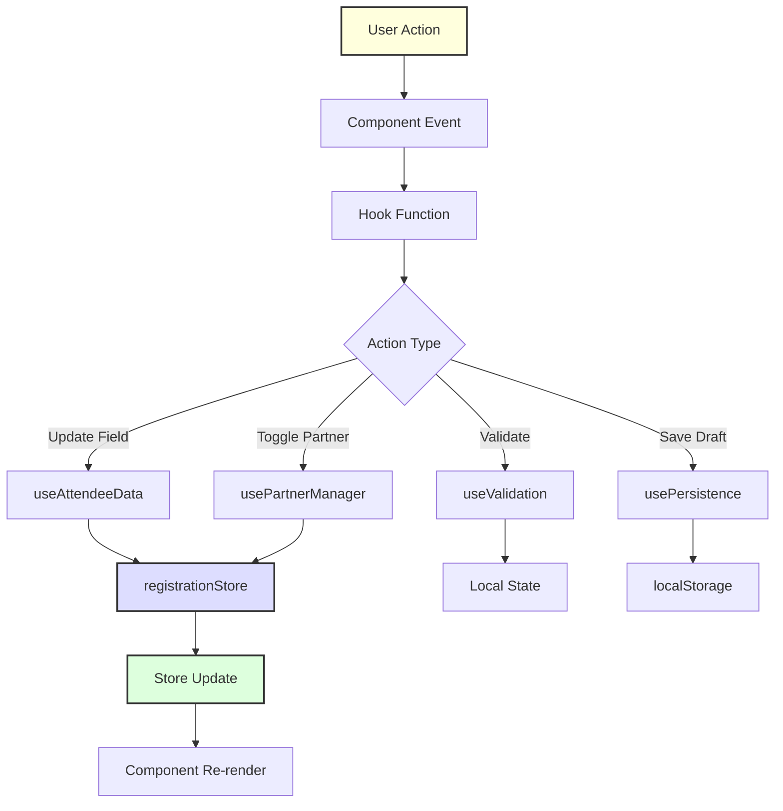
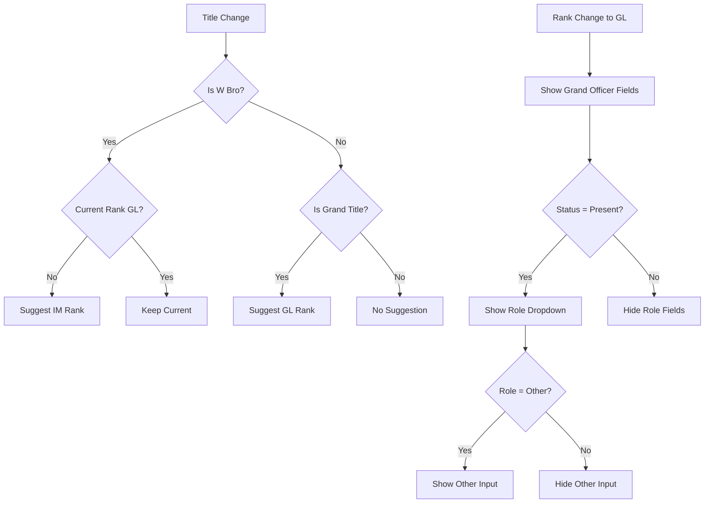
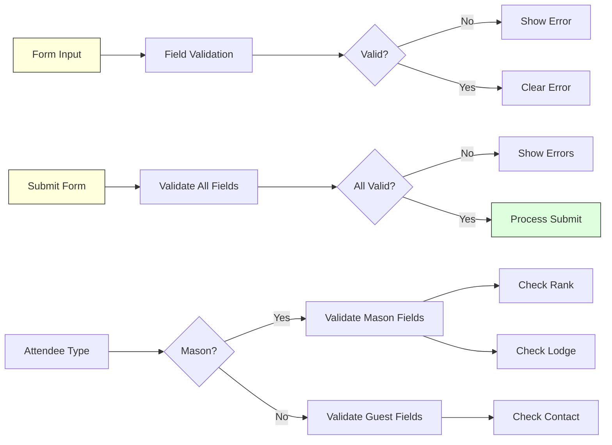

# Forms Architecture Diagram

## Component Hierarchy



## Data Flow



## Component Relationships



## Directory Structure

```
Forms/
├── attendee/
│   ├── AttendeeWithPartner.tsx      # Container for attendee + partner
│   ├── IndividualsForm.tsx          # Individual registration layout
│   ├── LodgesForm.tsx               # Lodge group registration
│   ├── DelegationsForm.tsx          # Delegation registration
│   ├── lib/
│   │   ├── useAttendeeData.ts       # Attendee state management
│   │   ├── usePartnerManager.ts     # Partner relationship logic
│   │   └── usePersistence.ts        # Draft persistence
│   ├── utils/
│   │   ├── attendeeTypeRenderer.tsx # Dynamic form selection
│   │   ├── businessLogic.ts         # Business rules
│   │   ├── constants.ts             # Domain constants
│   │   ├── formatters.ts            # Data formatting
│   │   └── validation.ts            # Validation rules
│   └── types.ts                     # TypeScript interfaces
│
├── basic-details/
│   ├── BasicInfo.tsx                # Personal details
│   ├── ContactInfo.tsx              # Contact information
│   ├── AdditionalInfo.tsx           # Dietary/special needs
│   └── ContactConfirmationMessage.tsx
│
├── mason/
│   ├── Layouts/
│   │   └── MasonForm.tsx            # Mason form composition
│   ├── lib/
│   │   ├── GrandLodgeSelection.tsx  # Grand Lodge search
│   │   └── LodgeSelection.tsx       # Lodge search
│   └── utils/
│       └── GrandOfficerFields.tsx   # Grand Officer details
│
├── guest/
│   └── Layouts/
│       └── GuestForm.tsx            # Guest form composition
│
└── shared/
    ├── AutocompleteInput.tsx        # Search dropdown
    ├── FieldComponents.tsx          # Basic form fields
    ├── PartnerToggle.tsx            # Partner add/remove
    └── TermsAndConditions.tsx       # T&C component
```

## State Management Flow



## Business Logic Flow



## Validation Flow

