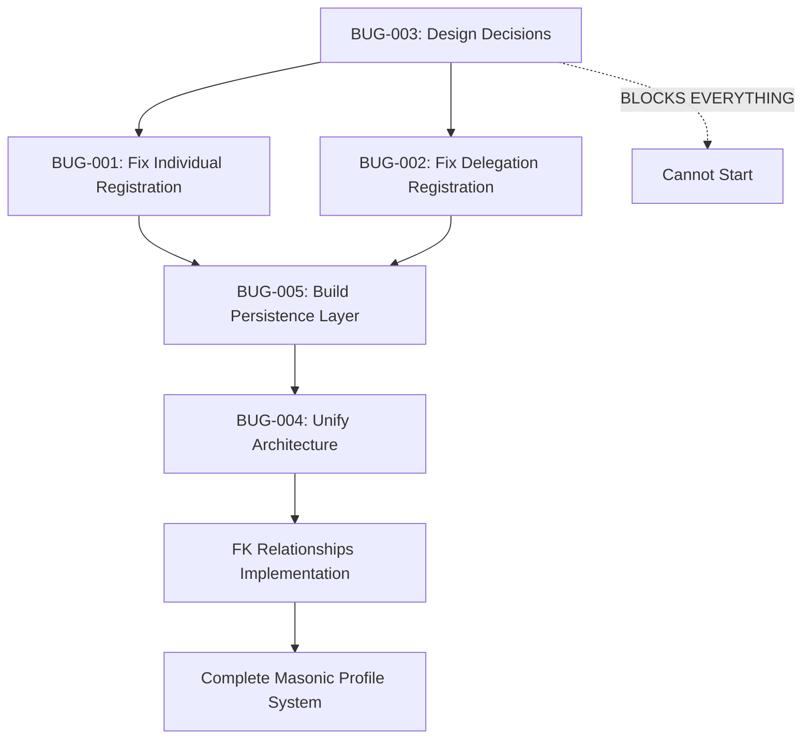

# BLOCKING ISSUES SUMMARY: Masonic Profile FK Relationships Implementation

## Executive Summary
**STATUS**: 🔴 **COMPLETELY BLOCKED** - Cannot proceed with masonic profile FK relationships implementation  
**BLOCKING BUGS**: 5 critical issues identified  
**ESTIMATED RESOLUTION TIME**: 4-6 days minimum  
**ROOT CAUSE**: Fundamental data persistence layer is broken  

## Critical Blocking Issues Overview

### 🔴 **BUG-001: Individual Registration Data Loss** (P0 - CRITICAL)
- **Problem**: Individual registration API doesn't create masonic_profiles records at all
- **Impact**: 100% data loss of masonic information for most common registration type
- **Why Blocking**: Cannot create FK relationships to non-existent records
- **Location**: `/api/registrations/individuals/route.ts` + RPC function

### 🟡 **BUG-002: Delegation Registration Gap** (P1 - HIGH)  
- **Problem**: Delegation registration stores masonic data in JSONB only, no normalized records
- **Impact**: Inconsistent data architecture across registration types
- **Why Blocking**: Cannot create consistent FK relationships when some attendees have no masonic_profiles
- **Location**: `/api/registrations/delegation/route.ts` + RPC function

### 🟠 **BUG-003: Design Ambiguity** (P1 - BLOCKING)
- **Problem**: Critical design decisions undefined for FK relationship implementation
- **Impact**: Multiple valid interpretations could lead to wrong solution
- **Why Blocking**: Cannot write PRD or tests without clear requirements
- **Requires**: Stakeholder decisions on 5 critical design questions

### 🟡 **BUG-004: Architecture Inconsistency** (P1 - HIGH)
- **Problem**: Three different masonic data storage patterns across registration types
- **Impact**: Cannot implement unified FK relationships
- **Why Blocking**: Inconsistent source data prevents unified solution
- **Scope**: System-wide architectural debt

### 🟡 **BUG-005: Persistence Layer Gap** (P1 - HIGH)
- **Problem**: Rich Zustand store data not mapped to normalized database storage
- **Impact**: Comprehensive masonic data captured but lost in persistence
- **Why Blocking**: FK relationships need actual normalized data to reference
- **Requires**: Complete persistence service implementation

## Implementation Dependency Chain

## What Cannot Be Done Until Issues Are Resolved

### ❌ **Cannot Create PRD**
- Design ambiguities prevent requirement specification
- Unknown relationship patterns prevent technical specification
- Missing business rules prevent constraint definition

### ❌ **Cannot Write Tests**
- No source data for test scenarios (masonic_profiles don't exist)
- Unknown expected behaviors due to design ambiguity
- Inconsistent data architecture prevents comprehensive testing

### ❌ **Cannot Implement Database Migrations**
- FK columns need existing records to reference
- Constraint definitions require design decisions
- Data migration logic depends on consistency rules

### ❌ **Cannot Modify APIs**
- Registration APIs need working masonic profile creation first
- FK population logic requires persistence service
- Validation rules depend on design decisions

### ❌ **Cannot Optimize Performance**
- Query patterns unknown due to relationship ambiguity
- Index strategies require access pattern decisions
- Caching approaches depend on data consistency rules

## Required Resolution Sequence

### **Phase 1: Design Clarification** (IMMEDIATE - 1 day)
**Stakeholder Input Required**:
1. **Bidirectional Relationship Justification**: Why `contacts.masonic_profile_id` needed?
2. **Attendees Access Pattern**: Direct FK or via contacts?
3. **Data Consistency Rules**: How to handle conflicting FK paths?
4. **Attendees Without Contacts**: Allowed to have masonic profiles?
5. **Creation Triggers**: When should masonic_profiles be auto-created?

**Deliverable**: Clear answers to all 5 design questions

### **Phase 2: Data Persistence Fixes** (2-3 days)
**Technical Work**:
1. Fix individual registration to create masonic_profiles 
2. Enhance delegation registration to create masonic_profiles
3. Build Zustand-to-database persistence service
4. Ensure comprehensive test coverage

**Deliverable**: Working masonic profile creation for all registration types

### **Phase 3: Architecture Unification** (1-2 days)
**Technical Work**:
1. Standardize masonic data storage patterns
2. Implement consistent validation rules
3. Optimize query performance
4. Document architectural decisions

**Deliverable**: Unified masonic data architecture

### **Phase 4: FK Implementation** (1 day)
**Technical Work**:
1. Add FK columns to contacts and attendees tables
2. Populate existing records with FK relationships
3. Implement constraint validation
4. Update API responses

**Deliverable**: Complete FK relationship system

## Risk Assessment

### **HIGH RISK: Stakeholder Decision Delays**
- Design ambiguities require business stakeholder input
- Wrong decisions could require complete rework
- **Mitigation**: Provide specific decision format with clear options

### **MEDIUM RISK: Data Migration Complexity**
- Existing data may not fit new relationship constraints
- Multiple registration types require different migration strategies
- **Mitigation**: Comprehensive testing before production migration

### **LOW RISK: Performance Impact**
- Additional FK columns and constraints may impact performance
- Query patterns may need optimization
- **Mitigation**: Performance testing and index optimization

## Success Criteria for Unblocking

### ✅ **Design Phase Complete**
- [ ] All 5 design questions answered with clear rationale
- [ ] Business requirements documented
- [ ] Technical constraints defined

### ✅ **Persistence Phase Complete**
- [ ] Individual registrations create masonic_profiles ✅
- [ ] Delegation registrations create masonic_profiles ✅
- [ ] 100% Zustand data mapped to database ✅
- [ ] Comprehensive test coverage ✅

### ✅ **Architecture Phase Complete**  
- [ ] Consistent storage patterns across all registration types ✅
- [ ] Unified validation rules ✅
- [ ] Performance benchmarks met ✅

### ✅ **Implementation Phase Complete**
- [ ] FK columns added and populated ✅
- [ ] Constraint validation working ✅
- [ ] API integration complete ✅
- [ ] Full system testing passed ✅

## Next Steps

1. **IMMEDIATE**: Provide answers to the 5 design questions in BUG-003
2. **PHASE 2**: Begin fixing individual registration masonic profile creation
3. **PHASE 3**: Enhance delegation registration for consistency
4. **PHASE 4**: Build comprehensive persistence service
5. **PHASE 5**: Implement FK relationships

**CANNOT PROCEED** until Phase 1 design decisions are provided by stakeholders.