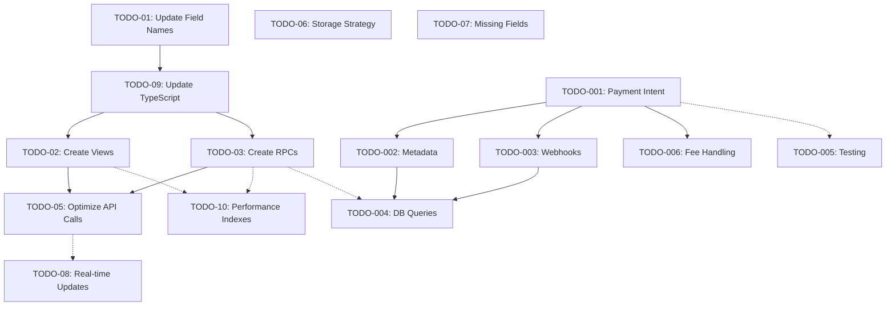

# LodgeTix TODO Orchestration Plan

## Phase 1 Analysis Complete ✅

### Dependency Mapping & Critical Path



### Execution Strategy: Three Parallel Work Streams

## Work Stream A: Core Database Fixes (Critical Path)
**Priority: HIGHEST - Blocks other work**

### Sequential Phase A1 (Week 1)
```
Subagent Task: TODO-01-FIELD-NAMES
Instructions: 
- Execute TODO-01-UPDATE-CODE-FIELD-NAMES-REVISED.md
- Replace all field name mismatches:
  - customer_id → contact_id
  - organization → organisation  
  - organizer → organiser
  - Fix ticket count fields
  - Remove computed fields from types
- Use global find & replace
- Verify all imports still work
Success Criteria: Return "TODO-01-COMPLETE" when all field names updated
Files to modify: All files containing old field names (use grep to find)
Dependencies: None - start immediately
```

### Sequential Phase A2 (Week 1)
```
Subagent Task: TODO-09-TYPESCRIPT
Instructions:
- Execute TODO-09-UPDATE-TYPE-DEFINITIONS.md
- Generate new types from database schema
- Update all TypeScript interfaces
- Add strict null checks
- Create type guards and utility types
- Implement Zod validation schemas
Success Criteria: Return "TODO-09-COMPLETE" when types match database
Files to modify: shared/types/*.ts, all component prop interfaces
Dependencies: TODO-01 must be complete
```

### Parallel Phase A3 (Week 2)
```
Parallel Subagent Batch: DATABASE-OPTIMIZATION
- Subagent 1: TODO-02-VIEWS
  Instructions: Create all database views per TODO-02-CREATE-DATABASE-VIEWS.md
  Success: Return "TODO-02-COMPLETE"
  
- Subagent 2: TODO-03-RPCS  
  Instructions: Create all RPC functions per TODO-03-CREATE-RPC-FUNCTIONS.md
  Success: Return "TODO-03-COMPLETE"
  
- Subagent 3: TODO-10-INDEXES
  Instructions: Add performance indexes per TODO-10-PERFORMANCE-INDEXES.md
  Success: Return "TODO-10-COMPLETE"
```

### Sequential Phase A4 (Week 3)
```
Subagent Task: TODO-05-API-OPTIMIZATION
Instructions:
- Execute TODO-05-OPTIMIZE-API-CALLS.md
- Replace multiple API calls with view queries
- Implement caching strategy
- Batch operations
- Optimize select statements
Success Criteria: Return "TODO-05-COMPLETE" when API calls minimized
Files to modify: lib/api/*.ts, components that fetch data
Dependencies: TODO-02 and TODO-03 must be complete
```

## Work Stream B: Stripe Connect Implementation
**Priority: HIGH - Revenue critical**

### Sequential Phase B1 (Week 1)
```
Subagent Task: STRIPE-001-PAYMENT-INTENT
Instructions:
- Execute docs/TODO-001-stripe-connect-payment-intent.md
- Update payment intent creation for Connect
- Add on_behalf_of parameter
- Implement platform fees
- Add comprehensive metadata
Success Criteria: Return "STRIPE-001-COMPLETE" when payments route correctly
Files to modify: app/api/stripe/create-payment-intent/route.ts
Dependencies: None - can start immediately
```

### Parallel Phase B2 (Week 2)
```
Parallel Subagent Batch: STRIPE-ENHANCEMENT
- Subagent 1: STRIPE-002-METADATA
  Instructions: Implement metadata structure per TODO-002
  Success: Return "STRIPE-002-COMPLETE"
  
- Subagent 2: STRIPE-003-WEBHOOKS
  Instructions: Update webhooks for Connect per TODO-003
  Success: Return "STRIPE-003-COMPLETE"
  
- Subagent 3: STRIPE-006-FEES
  Instructions: Implement fee handling per TODO-006
  Success: Return "STRIPE-006-COMPLETE"
```

### Sequential Phase B3 (Week 2-3)
```
Subagent Task: STRIPE-004-QUERIES
Instructions:
- Execute docs/TODO-004-organization-data-queries.md
- Create efficient queries for payment data
- Align with RPC functions from TODO-03
- Optimize for payment processing
Success Criteria: Return "STRIPE-004-COMPLETE"
Files to modify: lib/api/stripe-queries.ts (new file)
Dependencies: STRIPE-002 and STRIPE-003 should be complete
```

### Continuous Phase B4
```
Subagent Task: STRIPE-005-TESTING
Instructions:
- Execute docs/TODO-005-stripe-connect-testing.md continuously
- Test each Stripe feature as implemented
- Create test accounts and scenarios
- Document test results
Success Criteria: Return "STRIPE-005-PROGRESS-[feature]" after each test
Files to modify: Test documentation
Dependencies: Test after each Stripe feature is implemented
```

## Work Stream C: Feature Implementation
**Priority: MEDIUM - Enhances functionality**

### Parallel Independent Tasks (Week 3-4)
```
Parallel Subagent Batch: FEATURES
- Subagent 1: TODO-08-REALTIME
  Instructions: Implement real-time updates per TODO-08
  Success: Return "TODO-08-COMPLETE"
  Dependencies: Can start anytime
  
- Subagent 2: TODO-06-STORAGE
  Instructions: Implement storage strategy per TODO-06
  Success: Return "TODO-06-COMPLETE"
  Dependencies: Can start anytime
  
- Subagent 3: TODO-07-FIELDS
  Instructions: Add missing database fields per TODO-07
  Success: Return "TODO-07-COMPLETE"
  Dependencies: Should align with other DB changes
```

## Subagent Deployment Schedule

### Week 1 Deployment
1. **Deploy immediately**: TODO-01 subagent (Critical blocker)
2. **Deploy immediately**: STRIPE-001 subagent (Can run parallel)
3. **Deploy after TODO-01**: TODO-09 subagent

### Week 2 Deployment
1. **Deploy parallel batch**: DATABASE-OPTIMIZATION (3 subagents)
2. **Deploy parallel batch**: STRIPE-ENHANCEMENT (3 subagents)
3. **Deploy continuous**: STRIPE-005 testing subagent

### Week 3 Deployment
1. **Deploy sequential**: TODO-05 subagent (after views/RPCs)
2. **Deploy sequential**: STRIPE-004 subagent
3. **Deploy parallel batch**: FEATURES (3 subagents)

### Week 4 Deployment
1. **Integration testing**: Deploy verification subagents
2. **Final cleanup**: Deploy documentation subagent

## Risk Mitigation & Coordination

### Critical Dependencies
1. **TODO-01 is the ultimate blocker** - Must complete first
2. **TODO-09 blocks all TypeScript work** - High priority
3. **Views/RPCs must exist before optimization** - Coordinate timing

### Parallel Coordination Points
1. **Database changes**: TODO-02, TODO-03, TODO-07 may conflict
2. **API modifications**: TODO-05 and TODO-08 touch similar files
3. **Stripe integration**: All Stripe TODOs share webhook handler

### Failure Recovery
- If subagent returns "FAILED", analyze reason
- Re-deploy with adjusted instructions
- Consider breaking task into smaller pieces
- Escalate blockers immediately

## Success Metrics

### Phase Completion Signals
- **Phase A complete**: When TODO-05 returns "COMPLETE"
- **Phase B complete**: When all STRIPE TODOs return "COMPLETE"
- **Phase C complete**: When all FEATURE TODOs return "COMPLETE"

### Overall Success
- All 16 active TODOs report "COMPLETE"
- Integration tests pass
- No regression in existing functionality
- Performance metrics improved

## Next Steps

1. **Approve this orchestration plan**
2. **Begin Week 1 deployments immediately**
3. **Monitor subagent progress signals**
4. **Coordinate integration points**
5. **Adjust plan based on actual progress**