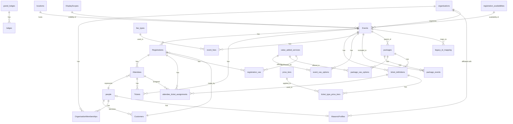

# Supabase Database Tables Documentation (Updated)

This document provides a comprehensive overview of all tables in the Supabase database for LodgeTix-UGLNSW-v2, with updated schema information for the new UUID and slug-based identification system.

## Table Overview

The database contains the following tables, organized by logical domain:

### Core Tables
- Events - Event information and details (updated with UUID/slug system)
- Tickets - Issued tickets for attendees
- Registrations - Record of event registrations
- Attendees - Information about people attending events

### User and Identity Tables
- Customers - Customer information
- people - Personal information for all individuals
- user_roles - User role assignments

### Masonic-specific Tables
- grand_lodges - Grand Lodge organizations
- lodges - Individual lodges under grand lodges
- MasonicProfiles - Masonic-specific information for individuals

### Organization Tables
- organisations - Organizations of various types
- OrganisationMemberships - Memberships of people in organizations
- locations - Physical locations for events and organizations

### Package and Ticket Definition Tables
- packages - Event packages containing multiple events
- package_events - Mapping of events to packages
- ticket_definitions - Definitions of ticket types available
- EventTickets - Availability and pricing for tickets
- price_tiers - Pricing tiers for tickets
- ticket_type_price_tiers - Price tier assignments for ticket types

### Value-Added Services Tables
- value_added_services - Extra services/products offered
- event_vas_options - VAS options available for events
- package_vas_options - VAS options available for packages
- registration_vas - VAS items purchased with registrations

### System Tables
- DisplayScopes - Display scopes for visibility control
- registration_availabilities - Registration availability options
- legacy_id_mapping - Maps legacy string IDs to UUIDs (transition table)

## Detailed Table Documentation

### Events (Updated Schema)

This table stores information about events in the system. The schema has been updated to use UUIDs as primary keys and include slugs for URL-friendly identification.

**Table Name:** `Events`

| Column | Type | Nullable | Description |
|--------|------|----------|-------------|
| id | uuid | No | Primary key (UUID) |
| slug | text | No | URL-friendly identifier (unique) |
| title | text | No | Event title/name |
| description | text | Yes | Detailed event description |
| event_start | timestamptz | No | Event start date/time |
| event_end | timestamptz | Yes | Event end date/time |
| location | text | Yes | Text description of location |
| image_url | text | Yes | URL for event image |
| type | text | Yes | Type of event |
| featured | boolean | Yes | Whether event is featured (default: false) |
| is_multi_day | boolean | Yes | Whether event spans multiple days (default: false) |
| parent_event_id | uuid | Yes | Parent event for child/sub-events |
| event_includes | text[] | Yes | Features included with the event |
| important_information | text[] | Yes | Important event information |
| latitude | float | Yes | Latitude of event location |
| longitude | float | Yes | Longitude of event location |
| is_purchasable_individually | boolean | Yes | Whether tickets can be purchased individually (default: true) |
| created_at | timestamptz | Yes | Record creation timestamp (default: NOW()) |
| updated_at | timestamptz | Yes | Record update timestamp (default: NOW()) |
| legacy_id | text | Yes | Original string ID (for transition period) |

**Foreign Keys:**
- parent_event_id → Events.id

**Indexes:**
- Primary key on id
- Unique index on slug (events_slug_idx)
- Index on parent_event_id

**Triggers:**
- update_events_modtime: Updates the updated_at field on any change

### legacy_id_mapping (New Table)

This table maintains the relationship between legacy string IDs and new UUIDs for the transition period.

**Table Name:** `legacy_id_mapping`

| Column | Type | Nullable | Description |
|--------|------|----------|-------------|
| legacy_id | text | No | Primary key (original string ID) |
| uuid | uuid | No | New UUID identifier |
| slug | text | No | URL-friendly slug |
| created_at | timestamptz | Yes | Record creation timestamp (default: NOW()) |

**Foreign Keys:**
- uuid → Events.id

**Indexes:**
- Primary key on legacy_id
- Index on uuid
- Index on slug

### Registrations (Updated for UUID References)

This table stores registration records for events, updated to reference event UUIDs.

**Table Name:** `Registrations`

| Column | Type | Nullable | Description |
|--------|------|----------|-------------|
| registration_id | uuid | No | Primary key |
| customer_id | uuid | Yes | Customer who made the registration |
| event_id | uuid | Yes | Event being registered for (now UUID) |
| registration_date | timestamptz | Yes | Date of registration |
| status | string | Yes | Registration status |
| total_amount_paid | numeric | Yes | Total amount paid |
| total_price_paid | numeric | Yes | Total price of registration |
| payment_status | enum | Yes | Status of payment |
| agree_to_terms | boolean | Yes | Whether terms were agreed to |
| stripe_payment_intent_id | text | Yes | Stripe payment intent ID |
| primary_attendee_id | uuid | Yes | Primary attendee ID |
| registration_type | enum | Yes | Type of registration |
| created_at | timestamptz | Yes | Record creation timestamp |
| updated_at | timestamptz | Yes | Record update timestamp |

**Foreign Keys:**
- customer_id → Customers.id
- event_id → Events.id

**Indexes:**
- Primary key on registration_id
- idx_registrations_customer on customer_id
- idx_registrations_event on event_id
- idx_registrations_created_at on created_at
- idx_registrations_payment_status on payment_status

### Tickets (Updated for UUID References)

This table stores issued tickets for events, updated to reference event UUIDs.

**Table Name:** `Tickets`

| Column | Type | Nullable | Description |
|--------|------|----------|-------------|
| ticket_id | uuid | No | Primary key |
| attendee_id | uuid | No | Attendee this ticket belongs to |
| event_id | uuid | No | Event this ticket is for (now UUID) |
| ticket_definition_id | uuid | Yes | Ticket definition for this ticket |
| price_paid | numeric | No | Price paid for this ticket |
| status | string | No | Ticket status |
| seat_info | string | Yes | Seat information |
| reservation_id | string | Yes | Reservation ID if reserved |
| reservation_expires_at | timestamptz | Yes | When reservation expires |
| checked_in_at | timestamptz | Yes | When attendee checked in |
| original_price | numeric | Yes | Original price before discounts |
| payment_status | string | Yes | Payment status |
| purchased_at | timestamptz | Yes | When ticket was purchased |
| currency | string | Yes | Currency used for purchase |
| created_at | timestamptz | No | Record creation timestamp |
| updated_at | timestamptz | No | Record update timestamp |

**Foreign Keys:**
- attendee_id → Attendees.attendee_id
- event_id → Events.id
- ticket_definition_id → ticket_definitions.id

**Indexes:**
- Primary key on ticket_id
- Index on event_id
- Index on attendee_id

### ticket_definitions (Updated for UUID References)

This table defines types of tickets available, updated to reference event UUIDs.

**Table Name:** `ticket_definitions`

| Column | Type | Nullable | Description |
|--------|------|----------|-------------|
| id | uuid | No | Primary key |
| name | string | No | Ticket name |
| description | string | Yes | Ticket description |
| price | numeric | No | Base ticket price |
| event_id | uuid | Yes | Event this ticket is for (now UUID) |
| package_id | uuid | Yes | Package this ticket is for |
| eligibility_attendee_types | string[] | Yes | Eligible attendee types |
| eligibility_mason_rank | string | Yes | Required masonic rank if applicable |
| is_active | boolean | Yes | Whether ticket type is active |
| slug | string | Yes | URL-friendly identifier |
| created_at | timestamptz | No | Record creation timestamp |

**Foreign Keys:**
- event_id → Events.id
- package_id → packages.id

**Indexes:**
- Primary key on id
- Index on event_id
- Index on slug

## Database Functions and Procedures

### UUID/Slug Generation Functions

**generate_slug**
```sql
CREATE OR REPLACE FUNCTION generate_slug(title TEXT)
RETURNS TEXT AS $$
DECLARE
  slug TEXT;
  base_slug TEXT;
  counter INTEGER := 1;
BEGIN
  -- Create base slug from title
  base_slug := LOWER(
    REGEXP_REPLACE(
      REGEXP_REPLACE(title, '[^\w\s-]', '', 'g'), -- Remove non-word chars
      '[\s_-]+', '-', 'g'                        -- Replace spaces with hyphens
    )
  );
  
  -- Trim leading/trailing hyphens
  base_slug := TRIM(BOTH '-' FROM base_slug);
  
  -- Initial slug is the base slug
  slug := base_slug;
  
  -- Check if slug exists and append counter if needed
  WHILE EXISTS (SELECT 1 FROM public."Events" WHERE slug = slug) LOOP
    slug := base_slug || '-' || counter;
    counter := counter + 1;
  END LOOP;
  
  RETURN slug;
END;
$$ LANGUAGE plpgsql;
```

**update_modified_column**
```sql
CREATE OR REPLACE FUNCTION update_modified_column()
RETURNS TRIGGER AS $$
BEGIN
   NEW.updated_at = NOW();
   RETURN NEW;
END;
$$ LANGUAGE plpgsql;
```

## Entity Relationship Diagram



## Common Table Joins and Relationships

### Event Lookup and Navigation
1. Events → legacy_id_mapping (Find UUID or slug from legacy ID)
2. Events → slug (Direct access via URL-friendly identifier)
3. Events → id (Direct access via UUID primary key)
4. Events → Events (Parent-child event relationships)

### Event Registration Flow
1. Events → Registrations (One event has many registrations)
2. Registrations → Customers (Registrations are made by customers)
3. Registrations → Attendees (Registrations include multiple attendees)
4. Attendees → people (Attendees reference people records)
5. Attendees → Tickets (Attendees are assigned tickets)
6. Registrations → attendee_ticket_assignments (Tracks which attendees get which tickets)
7. Registrations → registration_vas (Tracks additional services purchased)

### Package and Event Structure
1. Events → packages (Parent events contain packages)
2. packages → package_events (Packages include multiple events)
3. packages → ticket_definitions (Packages have ticket definitions)
4. Events → ticket_definitions (Events have ticket definitions)
5. ticket_definitions → ticket_type_price_tiers (Ticket definitions have price tiers)

## References

- [UUID-MIGRATION.md](/docs/UUID-MIGRATION.md) - Migration guide from string IDs to UUIDs with slugs
- [Supabase Documentation](https://supabase.io/docs)
- [PostgreSQL Documentation](https://www.postgresql.org/docs/)