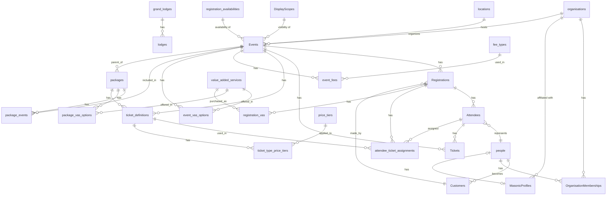

# Supabase Database Tables Documentation

This document provides a comprehensive overview of all tables in the Supabase database for LodgeTix-UGLNSW-v2. The database schema is designed to support an event ticketing and registration system with specific focus on masonic events.

## Table Overview

The database contains the following tables, organized by logical domain:

### Core Tables
- Events - Event information and details
- Tickets - Issued tickets for attendees
- Registrations - Record of event registrations
- Attendees - Information about people attending events

### User and Identity Tables
- Customers - Customer information
- people - Personal information for all individuals
- user_roles - User role assignments

### Masonic-specific Tables
- grand_lodges - Grand Lodge organizations
- lodges - Individual lodges under grand lodges
- MasonicProfiles - Masonic-specific information for individuals

### Organization Tables
- organisations - Organizations of various types
- OrganisationMemberships - Memberships of people in organizations
- locations - Physical locations for events and organizations

### Package and Ticket Definition Tables
- packages - Event packages containing multiple events
- package_events - Mapping of events to packages
- ticket_definitions - Definitions of ticket types available
- EventTickets - Availability and pricing for tickets
- price_tiers - Pricing tiers for tickets
- ticket_type_price_tiers - Price tier assignments for ticket types

### Value-Added Services Tables
- value_added_services - Extra services/products offered
- event_vas_options - VAS options available for events
- package_vas_options - VAS options available for packages
- registration_vas - VAS items purchased with registrations

### Fee Management Tables
- fee_types - Types of fees that can be applied
- event_fees - Specific fees associated with events

### System Tables
- DisplayScopes - Display scopes for visibility control
- registration_availabilities - Registration availability options

## Detailed Table Documentation

### Events

This table stores information about events in the system.

**Table Name:** `Events`

| Column | Type | Nullable | Description |
|--------|------|----------|-------------|
| id | uuid | No | Primary key |
| title | string | No | Event title/name |
| description | string | Yes | Detailed event description |
| eventStart | timestamp | Yes | Event start date/time |
| eventEnd | timestamp | Yes | Event end date/time |
| location | string | Yes | Text description of location |
| locationid | uuid | Yes | Reference to locations table |
| organiserorganisationid | uuid | Yes | Reference to organizing organization |
| price | number | Yes | Base price of the event |
| featured | boolean | Yes | Whether event is featured |
| imageUrl | string | Yes | URL for event image |
| isMultiDay | boolean | Yes | Whether event spans multiple days |
| isPurchasableIndividually | boolean | Yes | Whether tickets can be purchased individually |
| maxAttendees | number | Yes | Maximum number of attendees |
| latitude | number | Yes | Latitude of event location |
| longitude | number | Yes | Longitude of event location |
| eventIncludes | string[] | Yes | Features included with the event |
| importantInformation | string[] | Yes | Important event information |
| parentEventId | uuid | Yes | Parent event for child/sub-events |
| displayScopeId | uuid | Yes | Controls visibility of the event |
| registrationAvailabilityId | uuid | Yes | Controls registration availability |
| slug | string | Yes | URL-friendly identifier |
| type | string | Yes | Type of event |
| eventId | uuid | Yes | Legacy event identifier |
| createdAt | timestamp | Yes | Record creation timestamp |

**Foreign Keys:**
- locationid → locations.locationid
- organiserorganisationid → organisations.organisationid
- parentEventId → Events.id
- displayScopeId → DisplayScopes.id
- registrationAvailabilityId → registration_availabilities.id

**Indexes:**
- Primary key on id

### Registrations

This table stores registration records for events.

**Table Name:** `Registrations`

| Column | Type | Nullable | Description |
|--------|------|----------|-------------|
| registrationId | uuid | No | Primary key |
| customerId | uuid | Yes | Customer who made the registration |
| eventId | uuid | Yes | Event being registered for |
| registrationDate | timestamp | Yes | Date of registration |
| status | string | Yes | Registration status |
| totalAmountPaid | number | Yes | Total amount paid |
| totalPricePaid | number | Yes | Total price of registration |
| paymentStatus | enum | Yes | Status of payment |
| agreeToTerms | boolean | Yes | Whether terms were agreed to |
| stripePaymentIntentId | string | Yes | Stripe payment intent ID |
| primaryAttendeeId | uuid | Yes | Primary attendee ID |
| registrationType | enum | Yes | Type of registration |
| createdAt | timestamp | Yes | Record creation timestamp |
| updatedAt | timestamp | Yes | Record update timestamp |

**Foreign Keys:**
- customerId → Customers.id
- eventId → Events.id

**Indexes:**
- Primary key on registrationId
- idx_registrations_customer on customerId
- idx_registrations_event on eventId
- idx_registrations_created_at on createdAt
- idx_registrations_payment_status on paymentStatus

### Attendees

This table stores information about people attending events.

**Table Name:** `Attendees`

| Column | Type | Nullable | Description |
|--------|------|----------|-------------|
| attendeeid | uuid | No | Primary key |
| registrationid | uuid | No | Registration this attendee belongs to |
| attendeetype | enum | No | Type of attendee (Mason, Guest, etc.) |
| contactpreference | enum | No | How to contact this attendee |
| person_id | uuid | Yes | Reference to person record |
| relatedattendeeid | uuid | Yes | Related attendee (e.g. partner) |
| relationship | string | Yes | Relationship to related attendee |
| dietaryrequirements | string | Yes | Dietary requirements |
| specialneeds | string | Yes | Special needs/accommodations |
| eventtitle | string | Yes | Event title (redundant) |
| createdat | timestamp | No | Record creation timestamp |
| updatedat | timestamp | No | Record update timestamp |

**Foreign Keys:**
- registrationid → Registrations.registrationId
- person_id → people.person_id
- relatedattendeeid → Attendees.attendeeid

**Indexes:**
- Primary key on attendeeid

### people

This table stores personal information about individuals.

**Table Name:** `people`

| Column | Type | Nullable | Description |
|--------|------|----------|-------------|
| person_id | uuid | No | Primary key |
| first_name | string | Yes | First name |
| last_name | string | Yes | Last name |
| title | string | Yes | Title (Mr., Dr., etc.) |
| suffix | string | Yes | Name suffix |
| primary_email | string | Yes | Primary email address |
| primary_phone | string | Yes | Primary phone number |
| street_address | string | Yes | Street address |
| city | string | Yes | City |
| state | string | Yes | State/province |
| postal_code | string | Yes | Postal/zip code |
| country | string | Yes | Country |
| dietary_requirements | string | Yes | Dietary requirements |
| special_needs | string | Yes | Special needs/accommodations |
| auth_user_id | uuid | Yes | Auth user ID if this person has system account |
| is_organisation | boolean | No | Whether this record represents an organization |
| created_at | timestamp | No | Record creation timestamp |
| updated_at | timestamp | No | Record update timestamp |

**Foreign Keys:**
- None

**Indexes:**
- Primary key on person_id

### Customers

This table stores customer information for registrations and billing.

**Table Name:** `Customers`

| Column | Type | Nullable | Description |
|--------|------|----------|-------------|
| id | uuid | No | Primary key |
| firstName | string | Yes | First name |
| lastName | string | Yes | Last name |
| email | string | Yes | Email address |
| phone | string | Yes | Phone number |
| businessName | string | Yes | Business name |
| addressLine1 | string | Yes | Address line 1 |
| addressLine2 | string | Yes | Address line 2 |
| city | string | Yes | City |
| state | string | Yes | State/province |
| postalCode | string | Yes | Postal/zip code |
| country | string | Yes | Country |
| billingFirstName | string | Yes | Billing first name |
| billingLastName | string | Yes | Billing last name |
| billingOrganisationName | string | Yes | Billing organization name |
| billingEmail | string | Yes | Billing email |
| billingPhone | string | Yes | Billing phone |
| billingStreetAddress | string | Yes | Billing street address |
| billingCity | string | Yes | Billing city |
| billingState | string | Yes | Billing state/province |
| billingPostalCode | string | Yes | Billing postal/zip code |
| billingCountry | string | Yes | Billing country |
| stripeCustomerId | string | Yes | Stripe customer ID |
| organisationId | uuid | Yes | Organization ID if customer represents an org |
| contactId | uuid | Yes | Contact ID |
| userId | uuid | Yes | User ID if customer has system account |
| person_id | uuid | Yes | Reference to person record |
| createdAt | timestamp | Yes | Record creation timestamp |
| updatedAt | timestamp | Yes | Record update timestamp |

**Foreign Keys:**
- person_id → people.person_id

**Indexes:**
- Primary key on id

### Tickets

This table stores issued tickets for events.

**Table Name:** `Tickets`

| Column | Type | Nullable | Description |
|--------|------|----------|-------------|
| ticketid | uuid | No | Primary key |
| attendeeid | uuid | No | Attendee this ticket belongs to |
| eventid | uuid | No | Event this ticket is for |
| ticketdefinitionid | uuid | Yes | Ticket definition for this ticket |
| pricepaid | number | No | Price paid for this ticket |
| status | string | No | Ticket status |
| seatinfo | string | Yes | Seat information |
| reservationId | string | Yes | Reservation ID if reserved |
| reservationExpiresAt | timestamp | Yes | When reservation expires |
| checkedinat | timestamp | Yes | When attendee checked in |
| originalPrice | number | Yes | Original price before discounts |
| paymentStatus | string | Yes | Payment status |
| purchasedAt | timestamp | Yes | When ticket was purchased |
| currency | string | Yes | Currency used for purchase |
| createdat | timestamp | No | Record creation timestamp |
| updatedat | timestamp | No | Record update timestamp |

**Foreign Keys:**
- attendeeid → Attendees.attendeeid
- eventid → Events.id
- ticketdefinitionid → ticket_definitions.id

**Indexes:**
- Primary key on ticketid

### grand_lodges

This table stores information about Masonic Grand Lodges.

**Table Name:** `grand_lodges`

| Column | Type | Nullable | Description |
|--------|------|----------|-------------|
| id | uuid | No | Primary key |
| name | string | No | Grand Lodge name |
| country | string | Yes | Country of operation |
| country_code_iso3 | string | Yes | ISO3 country code |
| abbreviation | string | Yes | Abbreviation/short name |
| created_at | timestamp | No | Record creation timestamp |

**Foreign Keys:**
- None

**Indexes:**
- Primary key on id
- idx_grand_lodges_name_trigram on name (gin_trgm_ops)

### lodges

This table stores information about individual Masonic Lodges.

**Table Name:** `lodges`

| Column | Type | Nullable | Description |
|--------|------|----------|-------------|
| id | uuid | No | Primary key |
| name | string | No | Lodge name |
| number | number | Yes | Lodge number |
| grand_lodge_id | uuid | Yes | Grand Lodge this lodge belongs to |
| district | string | Yes | District/province within Grand Lodge |
| area_type | string | Yes | Type of area |
| meeting_place | string | Yes | Meeting location |
| display_name | string | Yes | Display name |
| created_at | timestamp | No | Record creation timestamp |

**Foreign Keys:**
- grand_lodge_id → grand_lodges.id

**Indexes:**
- Primary key on id
- idx_lodges_name_trigram on name (gin_trgm_ops)
- idx_lodges_number_trigram on number (gin_trgm_ops)
- idx_lodges_grand_lodge_id on grand_lodge_id

### MasonicProfiles

This table stores Masonic-specific information for individuals.

**Table Name:** `MasonicProfiles`

| Column | Type | Nullable | Description |
|--------|------|----------|-------------|
| masonicprofileid | uuid | No | Primary key |
| person_id | uuid | Yes | Reference to person record |
| lodgeid | uuid | Yes | Lodge membership |
| rank | string | Yes | Masonic rank |
| masonictitle | string | Yes | Masonic title |
| grandrank | string | Yes | Grand rank |
| grandoffice | string | Yes | Grand office held |
| grandofficer | string | Yes | Whether person is a grand officer |
| createdat | timestamp | No | Record creation timestamp |
| updatedat | timestamp | No | Record update timestamp |

**Foreign Keys:**
- person_id → people.person_id (one-to-one)
- lodgeid → organisations.organisationid

**Indexes:**
- Primary key on masonicprofileid

### organisations

This table stores information about organizations.

**Table Name:** `organisations`

| Column | Type | Nullable | Description |
|--------|------|----------|-------------|
| organisationid | uuid | No | Primary key |
| name | string | No | Organization name |
| type | enum | No | Organization type |
| streetaddress | string | Yes | Street address |
| city | string | Yes | City |
| state | string | Yes | State/province |
| postalcode | string | Yes | Postal/zip code |
| country | string | Yes | Country |
| website | string | Yes | Website URL |
| createdat | timestamp | No | Record creation timestamp |
| updatedat | timestamp | No | Record update timestamp |

**Foreign Keys:**
- None

**Indexes:**
- Primary key on organisationid

### OrganisationMemberships

This table tracks memberships of people in organizations.

**Table Name:** `OrganisationMemberships`

| Column | Type | Nullable | Description |
|--------|------|----------|-------------|
| membershipid | uuid | No | Primary key |
| person_id | uuid | Yes | Person who is a member |
| organisationid | uuid | No | Organization they belong to |
| roleinorg | string | Yes | Role in the organization |
| isprimarycontact | boolean | Yes | Whether person is primary contact |
| createdat | timestamp | No | Record creation timestamp |
| updatedat | timestamp | No | Record update timestamp |

**Foreign Keys:**
- person_id → people.person_id
- organisationid → organisations.organisationid

**Indexes:**
- Primary key on membershipid

### locations

This table stores information about physical locations.

**Table Name:** `locations`

| Column | Type | Nullable | Description |
|--------|------|----------|-------------|
| locationid | uuid | No | Primary key |
| placename | string | No | Name of the place |
| streetaddress | string | Yes | Street address |
| suburb | string | Yes | Suburb/neighborhood |
| state | string | Yes | State/province |
| postalcode | string | Yes | Postal/zip code |
| country | string | Yes | Country |
| latitude | number | Yes | Latitude coordinates |
| longitude | number | Yes | Longitude coordinates |
| roomorarea | string | Yes | Specific room/area |
| capacity | number | Yes | Maximum capacity |
| createdat | timestamp | No | Record creation timestamp |
| updatedat | timestamp | No | Record update timestamp |

**Foreign Keys:**
- None

**Indexes:**
- Primary key on locationid

### packages

This table defines packages of multiple events.

**Table Name:** `packages`

| Column | Type | Nullable | Description |
|--------|------|----------|-------------|
| id | uuid | No | Primary key |
| name | string | No | Package name |
| description | string | Yes | Package description |
| includes_description | string[] | Yes | Features included in package |
| parent_event_id | uuid | Yes | Parent event for this package |
| created_at | timestamp | No | Record creation timestamp |

**Foreign Keys:**
- parent_event_id → Events.id

**Indexes:**
- Primary key on id

### package_events

This table maps events to packages.

**Table Name:** `package_events`

| Column | Type | Nullable | Description |
|--------|------|----------|-------------|
| id | uuid | No | Primary key |
| package_id | uuid | Yes | Package ID |
| event_id | uuid | Yes | Event included in package |

**Foreign Keys:**
- package_id → packages.id
- event_id → Events.id

**Indexes:**
- Primary key on id

### ticket_definitions

This table defines types of tickets available.

**Table Name:** `ticket_definitions`

| Column | Type | Nullable | Description |
|--------|------|----------|-------------|
| id | uuid | No | Primary key |
| name | string | No | Ticket name |
| description | string | Yes | Ticket description |
| price | number | No | Base ticket price |
| event_id | uuid | Yes | Event this ticket is for |
| package_id | uuid | Yes | Package this ticket is for |
| eligibility_attendee_types | string[] | Yes | Eligible attendee types |
| eligibility_mason_rank | string | Yes | Required masonic rank if applicable |
| is_active | boolean | Yes | Whether ticket type is active |
| created_at | timestamp | No | Record creation timestamp |

**Foreign Keys:**
- event_id → Events.id
| package_id → packages.id

**Indexes:**
- Primary key on id

### EventTickets

This table tracks availability and status of event tickets.

**Table Name:** `EventTickets`

| Column | Type | Nullable | Description |
|--------|------|----------|-------------|
| eventTicketId | uuid | No | Primary key |
| eventId | uuid | No | Event ID |
| ticketDefinitionId | uuid | Yes | Ticket definition ID |
| price | number | No | Ticket price |
| totalCapacity | number | No | Total number of tickets available |
| availableCount | number | No | Number of tickets still available |
| reservedCount | number | Yes | Number of tickets reserved |
| soldCount | number | Yes | Number of tickets sold |
| status | string | Yes | Ticket status |
| createdAt | timestamp | No | Record creation timestamp |
| updatedAt | timestamp | No | Record update timestamp |

**Foreign Keys:**
- None direct in schema, implied:
  - eventId → Events.id
  - ticketDefinitionId → ticket_definitions.id

**Indexes:**
- Primary key on eventTicketId

### price_tiers

This table defines pricing tiers for tickets.

**Table Name:** `price_tiers`

| Column | Type | Nullable | Description |
|--------|------|----------|-------------|
| tier_id | uuid | No | Primary key |
| name | string | No | Tier name |
| description | string | Yes | Tier description |
| tier_order | number | No | Display order of tiers |
| is_active | boolean | No | Whether tier is active |
| created_at | timestamp | No | Record creation timestamp |
| updated_at | timestamp | No | Record update timestamp |

**Foreign Keys:**
- None

**Indexes:**
- Primary key on tier_id

### ticket_type_price_tiers

This table assigns price tiers to ticket types.

**Table Name:** `ticket_type_price_tiers`

| Column | Type | Nullable | Description |
|--------|------|----------|-------------|
| id | uuid | No | Primary key |
| ticket_definition_id | uuid | No | Ticket definition ID |
| price_tier_id | uuid | No | Price tier ID |
| price | number | No | Price for this tier |
| start_datetime | timestamp | No | When tier becomes available |
| end_datetime | timestamp | No | When tier expires |
| quantity_limit | number | Yes | Maximum tickets at this tier |
| quantity_sold | number | No | Number of tickets sold at this tier |
| is_active | boolean | No | Whether tier is active |
| created_at | timestamp | No | Record creation timestamp |
| updated_at | timestamp | No | Record update timestamp |

**Foreign Keys:**
- ticket_definition_id → ticket_definitions.id
- price_tier_id → price_tiers.tier_id

**Indexes:**
- Primary key on id

### value_added_services

This table defines extra services/products that can be purchased.

**Table Name:** `value_added_services`

| Column | Type | Nullable | Description |
|--------|------|----------|-------------|
| id | uuid | No | Primary key |
| name | string | No | VAS name |
| description | string | Yes | VAS description |
| price | number | No | VAS price |
| type | string | Yes | Type of service |
| is_active | boolean | Yes | Whether VAS is active |
| created_at | timestamp | No | Record creation timestamp |

**Foreign Keys:**
- None

**Indexes:**
- Primary key on id

### event_vas_options

This table maps VAS options to events.

**Table Name:** `event_vas_options`

| Column | Type | Nullable | Description |
|--------|------|----------|-------------|
| id | uuid | No | Primary key |
| event_id | uuid | Yes | Event ID |
| vas_id | uuid | Yes | VAS ID |
| price_override | number | Yes | Overridden price |

**Foreign Keys:**
- event_id → Events.id
- vas_id → value_added_services.id

**Indexes:**
- Primary key on id

### package_vas_options

This table maps VAS options to packages.

**Table Name:** `package_vas_options`

| Column | Type | Nullable | Description |
|--------|------|----------|-------------|
| id | uuid | No | Primary key |
| package_id | uuid | Yes | Package ID |
| vas_id | uuid | Yes | VAS ID |
| price_override | number | Yes | Overridden price |

**Foreign Keys:**
- package_id → packages.id
- vas_id → value_added_services.id

**Indexes:**
- Primary key on id

### registration_vas

This table tracks VAS items purchased with registrations.

**Table Name:** `registration_vas`

| Column | Type | Nullable | Description |
|--------|------|----------|-------------|
| id | uuid | No | Primary key |
| registration_id | uuid | No | Registration ID |
| vas_id | uuid | Yes | VAS ID |
| quantity | number | Yes | Quantity purchased |
| price_at_purchase | number | No | Price at time of purchase |
| created_at | timestamp | No | Record creation timestamp |

**Foreign Keys:**
- registration_id → Registrations.registrationId
- vas_id → value_added_services.id

**Indexes:**
- Primary key on id

### fee_types

This table defines types of fees that can be applied.

**Table Name:** `fee_types`

| Column | Type | Nullable | Description |
|--------|------|----------|-------------|
| fee_type_id | uuid | No | Primary key |
| name | string | No | Fee name |
| description | string | Yes | Fee description |
| fee_calculation_type | string | No | How fee is calculated |
| fee_default_value | number | No | Default fee amount |
| is_active | boolean | No | Whether fee type is active |
| created_at | timestamp | No | Record creation timestamp |
| updated_at | timestamp | No | Record update timestamp |

**Foreign Keys:**
- None

**Indexes:**
- Primary key on fee_type_id

### event_fees

This table defines fees associated with events.

**Table Name:** `event_fees`

| Column | Type | Nullable | Description |
|--------|------|----------|-------------|
| event_fee_id | uuid | No | Primary key |
| event_id | uuid | No | Event ID |
| fee_type_id | uuid | No | Fee type ID |
| fee_value | number | No | Fee amount |
| applies_to | string | No | What the fee applies to |
| is_passed_to_customer | boolean | Yes | Whether fee is visible to customers |
| is_active | boolean | Yes | Whether fee is active |
| created_at | timestamp | No | Record creation timestamp |
| updated_at | timestamp | No | Record update timestamp |

**Foreign Keys:**
- event_id → Events.id
- fee_type_id → fee_types.fee_type_id

**Indexes:**
- Primary key on event_fee_id

### attendee_ticket_assignments

This table tracks which tickets are assigned to which attendees.

**Table Name:** `attendee_ticket_assignments`

| Column | Type | Nullable | Description |
|--------|------|----------|-------------|
| id | uuid | No | Primary key |
| registration_id | uuid | No | Registration ID |
| attendee_id | uuid | Yes | Attendee ID |
| ticket_definition_id | uuid | No | Ticket definition ID |
| price_at_assignment | number | No | Price at time of assignment |
| created_at | timestamp | No | Record creation timestamp |

**Foreign Keys:**
- registration_id → Registrations.registrationId
- attendee_id → Attendees.attendeeid
- ticket_definition_id → ticket_definitions.id

**Indexes:**
- Primary key on id

### DisplayScopes

This table defines visibility scopes for content.

**Table Name:** `DisplayScopes`

| Column | Type | Nullable | Description |
|--------|------|----------|-------------|
| id | uuid | No | Primary key |
| name | string | No | Scope name |
| createdAt | timestamp | No | Record creation timestamp |

**Foreign Keys:**
- None

**Indexes:**
- Primary key on id

### registration_availabilities

This table defines registration availability options.

**Table Name:** `registration_availabilities`

| Column | Type | Nullable | Description |
|--------|------|----------|-------------|
| id | uuid | No | Primary key |
| name | string | No | Availability name |
| created_at | timestamp | No | Record creation timestamp |

**Foreign Keys:**
- None

**Indexes:**
- Primary key on id

### user_roles

This table assigns roles to users.

**Table Name:** `user_roles`

| Column | Type | Nullable | Description |
|--------|------|----------|-------------|
| id | uuid | No | Primary key |
| user_id | uuid | No | User ID |
| role | string | No | Role name |
| created_at | timestamp | No | Record creation timestamp |
| updated_at | timestamp | No | Record update timestamp |

**Foreign Keys:**
- None explicit in schema, implied:
  - user_id → auth.users.id

**Indexes:**
- Primary key on id

## Entity Relationship Diagram

## Common Table Joins and Relationships

### Event Registration Flow
1. Events → Registrations (One event has many registrations)
2. Registrations → Customers (Registrations are made by customers)
3. Registrations → Attendees (Registrations include multiple attendees)
4. Attendees → people (Attendees reference people records)
5. Attendees → Tickets (Attendees are assigned tickets)
6. Registrations → attendee_ticket_assignments (Tracks which attendees get which tickets)
7. Registrations → registration_vas (Tracks additional services purchased)

### Masonic Hierarchy
1. grand_lodges → lodges (Grand lodges contain multiple lodges)
2. organisations ← lodges (Lodges are represented as organizations)
3. OrganisationMemberships → organisations (People are members of organizations)
4. people → MasonicProfiles (People have masonic profiles)

### Package and Event Structure
1. Events → packages (Parent events contain packages)
2. packages → package_events (Packages include multiple events)
3. packages → ticket_definitions (Packages have ticket definitions)
4. Events → ticket_definitions (Events have ticket definitions)
5. ticket_definitions → ticket_type_price_tiers (Ticket definitions have price tiers)

## References

- [Supabase Documentation](https://supabase.io/docs)
- [PostgreSQL Documentation](https://www.postgresql.org/docs/)