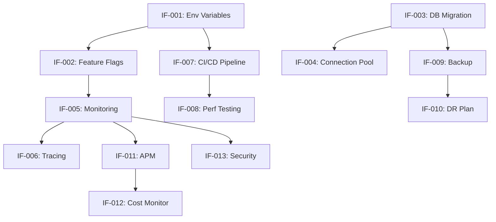

# Infrastructure Tasks Summary for Functions Architecture Refactor

## Quick Reference

| Task ID | Description | Priority | Dependencies | Time |
|---------|-------------|----------|--------------|------|
| IF-001 | Add New Environment Variables | High | None | 2h |
| IF-002 | Implement Feature Flags | High | IF-001 | 4h |
| IF-003 | Database Migration Strategy | High | None | 3h |
| IF-004 | Database Connection Pooling | Medium | IF-003 | 2h |
| IF-005 | Comprehensive Functions Monitoring | High | IF-001, IF-002 | 6h |
| IF-006 | Distributed Tracing | Medium | IF-005 | 4h |
| IF-007 | Update CI/CD Pipeline | High | IF-001 | 4h |
| IF-008 | Automated Performance Testing | Medium | IF-007 | 3h |
| IF-009 | Enhanced Backup Strategy | High | IF-003 | 3h |
| IF-010 | Disaster Recovery Plan | Medium | IF-009 | 4h |
| IF-011 | Application Performance Monitoring | High | IF-005 | 4h |
| IF-012 | Cost Monitoring and Optimization | Medium | IF-011 | 3h |
| IF-013 | Security Monitoring | High | IF-005 | 3h |

**Total Estimated Time:** 45 hours

## Implementation Phases

### Phase 1: Foundation (Week 1)
**Focus:** Essential configuration and migration readiness
- IF-001: Environment Variables ✓
- IF-003: Database Migration Strategy ✓
- IF-009: Enhanced Backup Strategy ✓

### Phase 2: Deployment & Monitoring (Week 2)
**Focus:** Safe deployment and observability
- IF-002: Feature Flags ✓
- IF-005: Comprehensive Monitoring ✓
- IF-007: CI/CD Pipeline Updates ✓
- IF-011: APM Implementation ✓

### Phase 3: Security & Reliability (Week 3)
**Focus:** Production hardening
- IF-013: Security Monitoring ✓
- IF-004: Connection Pooling ✓
- IF-010: Disaster Recovery ✓

### Phase 4: Optimization (Week 4)
**Focus:** Performance and cost efficiency
- IF-006: Distributed Tracing ✓
- IF-008: Performance Testing ✓
- IF-012: Cost Monitoring ✓

## Critical Path

## Risk Mitigation

### High-Risk Areas
1. **Database Migrations (IF-003)**
   - Risk: Data loss or corruption
   - Mitigation: Comprehensive backup strategy, staged rollout

2. **Environment Configuration (IF-001)**
   - Risk: Service disruption from missing config
   - Mitigation: Validation checks, gradual rollout

3. **Feature Flag Implementation (IF-002)**
   - Risk: Inconsistent user experience
   - Mitigation: Percentage-based rollout, monitoring

### Rollback Procedures
Every task includes:
- Immediate rollback strategy (< 5 minutes)
- Extended rollback procedure (> 5 minutes)
- Data recovery options
- Communication plan

## Success Metrics

### Technical Metrics
- Zero-downtime deployment achieved
- < 200ms p95 latency maintained
- < 0.1% error rate
- 99.95% uptime SLA

### Operational Metrics
- Deployment time reduced by 50%
- Incident detection time < 2 minutes
- Recovery time < 15 minutes
- Cost per transaction optimized

## Team Responsibilities

### DevOps Team
- IF-001, IF-003, IF-004, IF-007, IF-009, IF-010

### Platform Team
- IF-002, IF-005, IF-006, IF-011, IF-013

### Development Team
- IF-008, IF-012 (with DevOps support)

## Post-Implementation Review

### Week 5 Checklist
- [ ] All monitoring dashboards operational
- [ ] Runbooks documented and tested
- [ ] Team trained on new procedures
- [ ] Performance baselines established
- [ ] Cost optimization implemented
- [ ] Security scanning active
- [ ] DR procedures tested

### Success Criteria
- [ ] Functions architecture fully deployed
- [ ] All metrics within SLA
- [ ] No critical incidents during rollout
- [ ] Team confidence in new system
- [ ] Documentation complete