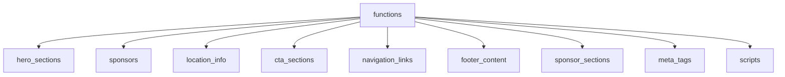

# Website Schema Design

## Design Philosophy

### Core Principles
1. **One Table Per Component** - Each visual component gets its own table
2. **Content, Not Style** - Store content only; styling remains in code
3. **Function-Specific Content** - Support different content per function/event
4. **Simple Relationships** - Use function_id to link content to specific events
5. **Flexible Storage** - Use JSONB for variable/extensible content
6. **Active/Draft States** - Support content staging with is_active flags

### Common Fields Pattern
Every table will include:
- `id` (UUID) - Primary key
- `function_id` (UUID) - Links to specific function (nullable for global content)
- `is_active` (BOOLEAN) - Enable/disable content
- `sort_order` (INTEGER) - Control display order
- `created_at` (TIMESTAMP)
- `updated_at` (TIMESTAMP)

## Schema Structure

### 1. Meta & SEO Configuration
```sql
website.meta_tags
- id UUID PRIMARY KEY
- function_id UUID REFERENCES functions(id)
- page_path VARCHAR(255) -- '/', '/about', etc.
- title VARCHAR(255)
- description TEXT
- keywords TEXT[]
- og_image VARCHAR(500)
- og_title VARCHAR(255)
- og_description TEXT
- twitter_card VARCHAR(50)
- canonical_url VARCHAR(500)
- robots VARCHAR(100) -- 'index,follow'
- additional_meta JSONB -- For extra meta tags
- is_active BOOLEAN DEFAULT true
- created_at TIMESTAMP
- updated_at TIMESTAMP
```

### 2. Hero Sections
```sql
website.hero_sections
- id UUID PRIMARY KEY
- function_id UUID REFERENCES functions(id)
- title VARCHAR(255)
- subtitle VARCHAR(255)
- description TEXT
- primary_cta_text VARCHAR(100)
- primary_cta_link VARCHAR(255)
- secondary_cta_text VARCHAR(100)
- secondary_cta_link VARCHAR(255)
- image_url VARCHAR(500)
- image_alt VARCHAR(255)
- background_image_url VARCHAR(500)
- show_dates BOOLEAN DEFAULT true
- show_location BOOLEAN DEFAULT true
- custom_content JSONB -- For additional fields
- is_active BOOLEAN DEFAULT true
- sort_order INTEGER DEFAULT 0
- created_at TIMESTAMP
- updated_at TIMESTAMP
```

### 3. Sponsors
```sql
website.sponsors
- id UUID PRIMARY KEY
- function_id UUID REFERENCES functions(id)
- name VARCHAR(255)
- logo_url VARCHAR(500)
- logo_alt VARCHAR(255)
- website_url VARCHAR(500)
- tier VARCHAR(50) -- 'grand', 'major', 'gold', 'silver', 'bronze'
- description TEXT
- is_active BOOLEAN DEFAULT true
- sort_order INTEGER DEFAULT 0
- created_at TIMESTAMP
- updated_at TIMESTAMP
```

### 4. Location Information
```sql
website.location_info
- id UUID PRIMARY KEY
- function_id UUID REFERENCES functions(id)
- venue_name VARCHAR(255)
- venue_badge VARCHAR(100) -- 'Premium Venue'
- address_line_1 VARCHAR(255)
- address_line_2 VARCHAR(255)
- city VARCHAR(100)
- state VARCHAR(50)
- postal_code VARCHAR(20)
- country VARCHAR(100)
- map_embed_url TEXT -- Google Maps embed URL
- directions_url VARCHAR(500)
- features JSONB -- Array of {icon: 'Building2', title: 'Historic Venue', description: '...'}
- transport_info TEXT
- parking_info TEXT
- accessibility_info TEXT
- is_active BOOLEAN DEFAULT true
- created_at TIMESTAMP
- updated_at TIMESTAMP
```

### 5. CTA Sections
```sql
website.cta_sections
- id UUID PRIMARY KEY
- function_id UUID REFERENCES functions(id)
- section_key VARCHAR(100) -- 'homepage_bottom', 'about_cta', etc.
- title VARCHAR(255)
- subtitle VARCHAR(255)
- description TEXT
- primary_cta_text VARCHAR(100)
- primary_cta_link VARCHAR(255)
- secondary_cta_text VARCHAR(100)
- secondary_cta_link VARCHAR(255)
- info_text VARCHAR(255) -- 'Limited places • Secure payment • Instant confirmation'
- background_style VARCHAR(50) -- 'gradient', 'solid', 'image'
- custom_content JSONB
- is_active BOOLEAN DEFAULT true
- sort_order INTEGER DEFAULT 0
- created_at TIMESTAMP
- updated_at TIMESTAMP
```

### 6. Navigation Links
```sql
website.navigation_links
- id UUID PRIMARY KEY
- function_id UUID REFERENCES functions(id)
- menu_location VARCHAR(50) -- 'header', 'mobile', 'footer_quick_links'
- label VARCHAR(100)
- url VARCHAR(255)
- icon VARCHAR(50) -- Icon name from lucide-react
- is_external BOOLEAN DEFAULT false
- open_in_new_tab BOOLEAN DEFAULT false
- requires_auth BOOLEAN DEFAULT false
- is_active BOOLEAN DEFAULT true
- sort_order INTEGER DEFAULT 0
- created_at TIMESTAMP
- updated_at TIMESTAMP
```

### 7. Footer Configuration
```sql
website.footer_content
- id UUID PRIMARY KEY
- function_id UUID REFERENCES functions(id)
- company_name VARCHAR(100) -- 'LodgeTix'
- company_description TEXT
- copyright_text VARCHAR(255)
- social_links JSONB -- Array of {platform: 'facebook', url: '...', icon: '...'}
- newsletter_enabled BOOLEAN DEFAULT false
- newsletter_title VARCHAR(100)
- newsletter_description TEXT
- external_links JSONB -- Array of {label: '...', url: '...', icon: '...'}
- is_active BOOLEAN DEFAULT true
- created_at TIMESTAMP
- updated_at TIMESTAMP
```

### 8. Sponsor Sections Configuration
```sql
website.sponsor_sections
- id UUID PRIMARY KEY
- function_id UUID REFERENCES functions(id)
- title VARCHAR(255) -- 'Our Distinguished Sponsors'
- subtitle VARCHAR(255) -- 'Supporting Masonic Excellence and Tradition'
- show_tiers BOOLEAN DEFAULT true
- layout VARCHAR(50) -- 'grid', 'carousel', 'list'
- is_active BOOLEAN DEFAULT true
- created_at TIMESTAMP
- updated_at TIMESTAMP
```

### 9. Third-party Scripts
```sql
website.scripts
- id UUID PRIMARY KEY
- function_id UUID REFERENCES functions(id)
- name VARCHAR(100) -- 'Cloudflare Turnstile', 'Google Analytics'
- script_url VARCHAR(500)
- script_content TEXT -- For inline scripts
- load_position VARCHAR(50) -- 'head', 'body_start', 'body_end'
- script_attributes JSONB -- {async: true, defer: false, ...}
- is_active BOOLEAN DEFAULT true
- sort_order INTEGER DEFAULT 0
- created_at TIMESTAMP
- updated_at TIMESTAMP
```

## Relationships



## Usage Examples

### 1. Get Homepage Hero for Current Function
```sql
SELECT * FROM website.hero_sections
WHERE function_id = $1 AND is_active = true
ORDER BY sort_order
LIMIT 1;
```

### 2. Get All Active Sponsors for Display
```sql
SELECT * FROM website.sponsors
WHERE function_id = $1 AND is_active = true
ORDER BY 
  CASE tier
    WHEN 'grand' THEN 1
    WHEN 'major' THEN 2
    WHEN 'gold' THEN 3
    WHEN 'silver' THEN 4
    WHEN 'bronze' THEN 5
  END,
  sort_order;
```

### 3. Get Navigation Menu
```sql
SELECT * FROM website.navigation_links
WHERE (function_id = $1 OR function_id IS NULL)
  AND menu_location = 'header'
  AND is_active = true
ORDER BY sort_order;
```

## Migration Strategy

1. **Phase 1**: Create schema and tables
2. **Phase 2**: Seed with current static content
3. **Phase 3**: Create admin UI for content management
4. **Phase 4**: Update components to read from database
5. **Phase 5**: Add caching layer for performance

## Benefits

1. **Content Management**: Non-developers can update website content
2. **A/B Testing**: Easy to test different content versions
3. **Multi-Event Support**: Different content per function/event
4. **Version History**: Can add versioning later if needed
5. **Performance**: Can cache aggressively since content changes infrequently
6. **SEO Flexibility**: Dynamic meta tags per page/function

## Considerations

1. **Caching**: Implement Redis/memory caching for frequently accessed content
2. **Fallbacks**: Components should have hardcoded fallbacks if database is unavailable
3. **Preview Mode**: Add preview functionality for draft content
4. **Audit Trail**: Consider adding audit tables for content changes
5. **Media Management**: Images should be stored in Supabase Storage, only URLs in database