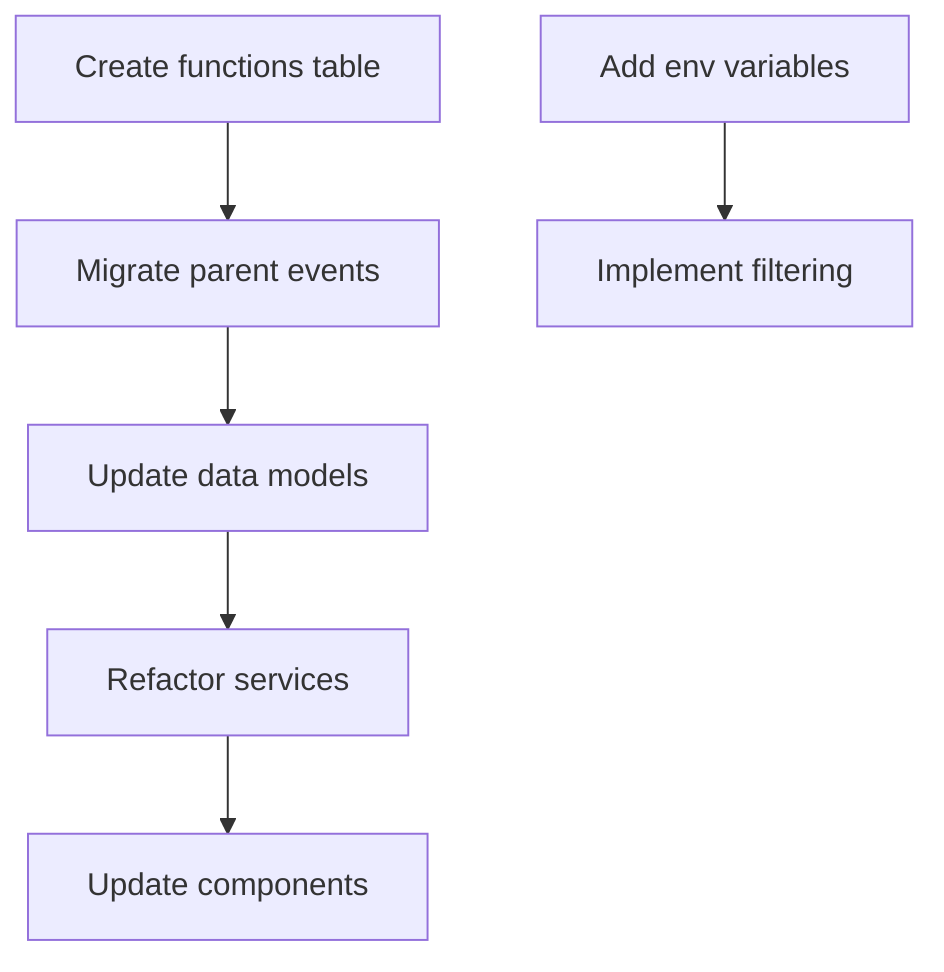

# Functions Architecture Refactor - Master TODO List

> **Single Source of Truth**: This document serves as the authoritative guide for all refactoring tasks. All sub-agents and team members should reference and update this document.

## Overview

This master TODO list coordinates the complete refactoring from parent-child events to functions-based architecture. Tasks are organized by area of concern with clear dependencies and validation criteria.

## Task Categories

1. **[DB]** Database Schema & Migration
2. **[DM]** Data Migration Scripts  
3. **[BE]** Backend Services & APIs
4. **[FE]** Frontend Components
5. **[TS]** Testing & Validation
6. **[IF]** Infrastructure & Configuration

## Critical Path Dependencies

## Task Status Legend

- 🔴 Not Started
- 🟡 In Progress
- 🟢 Complete
- 🔵 Blocked
- ⚫ Cancelled

---

## Detailed TODO Lists by Area

### [DB] Database Schema & Migration

**Completed** - See: `/docs/MIGRATION-TODOS-FUNCTIONS-REFACTOR.md`
- 43 detailed migration tasks (DB-001 to DB-043)
- 5 phases: Schema Addition, Data Migration, Schema Update, Cleanup, Validation
- Includes SQL operations, validation queries, rollback procedures
- Zero-downtime migration strategy

### [DM] Data Migration Scripts

**Completed** - Included in Database Migration document
- Parent event to functions data transformation
- Registration and package migration scripts
- Attendee relationship mapping
- Data integrity validation scripts

### [BE] Backend Services & APIs

**Completed** - See: Backend refactoring tasks created
- 15 detailed tasks (BE-001 to BE-015)
- TypeScript type updates, service refactoring, RPC updates
- Environment variable implementation
- Feature flag system for gradual rollout
- Backward compatibility layer

### [FE] Frontend Components

**Completed** - See: Frontend refactoring document created
- 15 detailed tasks (FE-001 to FE-015)
- Route restructuring, new function components
- Registration wizard updates
- A/B testing implementation
- Migration components for smooth transition

### [TS] Testing & Validation

**Completed** - See: Testing strategy document created
- 21 detailed tasks (TS-001 to TS-021)
- Database migration validation
- API compatibility testing
- E2E user flow testing
- Performance benchmarking
- Security validation

### [IF] Infrastructure & Configuration

**Completed** - See: `/docs/TODO-INFRASTRUCTURE-TASKS.md` and `/docs/TODO-INFRASTRUCTURE-SUMMARY.md`
- 13 detailed tasks (IF-001 to IF-013)
- Environment variable configuration
- Feature flag deployment strategy
- Blue-green migration approach
- Monitoring and alerting setup
- Zero-downtime deployment procedures

---

## Coordination Notes

- Each area will be detailed by specialized sub-agents
- All changes must maintain backward compatibility during transition
- Feature flags will control rollout
- Comprehensive testing required at each phase

## Risk Register

| Risk | Mitigation | Owner |
|------|------------|-------|
| Data integrity | Backup & validation | DBA |
| API breaking changes | Versioning | Backend |
| UI disruption | Feature flags | Frontend |

## Communication Plan

1. Daily standup on progress
2. Blocking issues escalated immediately
3. PR reviews required for all changes
4. Documentation updates concurrent with code

## Success Metrics

- [ ] Zero data loss
- [ ] All tests passing
- [ ] Performance benchmarks met
- [ ] Feature parity achieved
- [ ] Clean rollback possible