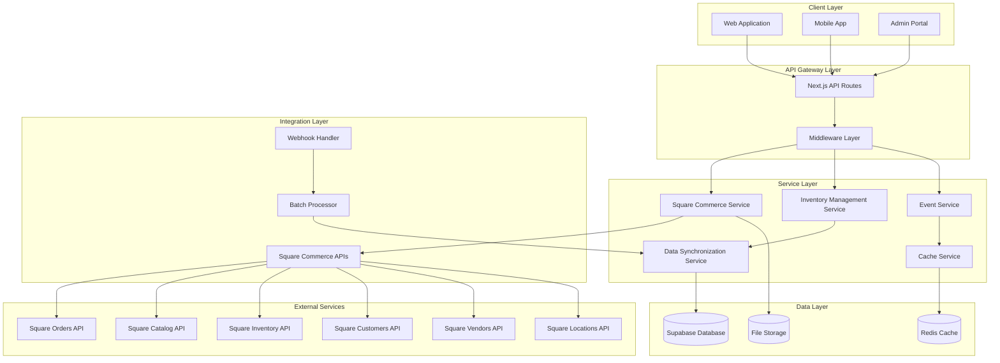
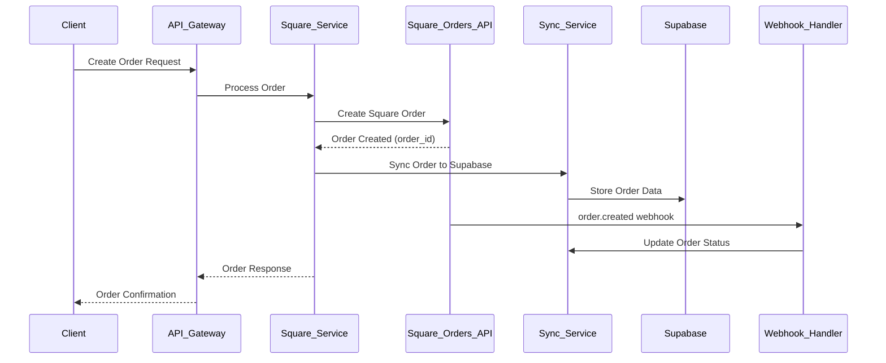
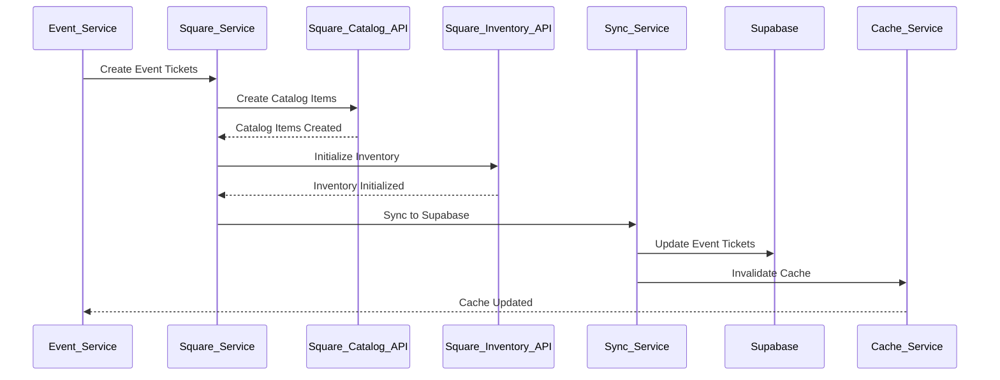
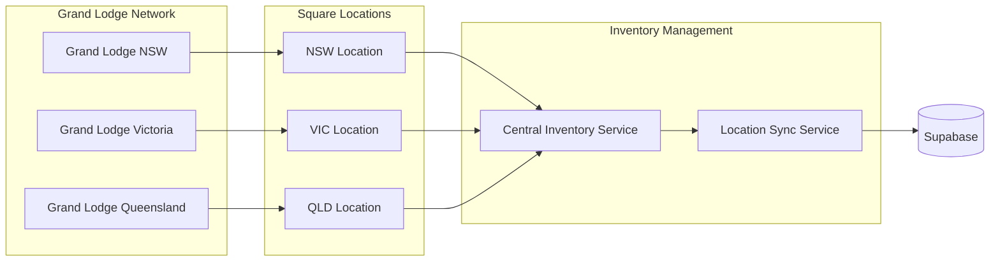

# Square Commerce API Integration - Technical Solutions Architecture

## Executive Summary

This document outlines a comprehensive technical architecture for integrating Square's Commerce APIs with the existing LodgeTix Supabase-based system. The solution leverages Square's Orders, Catalog, Inventory, Vendors, Customers, Merchants, and Locations APIs to create a unified commerce platform for Masonic event ticketing and inventory management.

## Table of Contents

1. [System Architecture](#1-system-architecture)
2. [Data Flow Diagrams](#2-data-flow-diagrams)
3. [API Integration Patterns](#3-api-integration-patterns)
4. [Data Synchronization Strategy](#4-data-synchronization-strategy)
5. [Caching Strategy](#5-caching-strategy)
6. [Security Architecture](#6-security-architecture)
7. [Scalability Considerations](#7-scalability-considerations)
8. [Error Handling & Resilience](#8-error-handling--resilience)
9. [Monitoring & Observability](#9-monitoring--observability)
10. [Migration Strategy](#10-migration-strategy)

---

## 1. System Architecture

### 1.1 High-Level Architecture Overview



### 1.2 Component Relationships

#### Core Services Architecture

1. **Square Commerce Service**: Central orchestrator for all Square API interactions
2. **Inventory Management Service**: Handles inventory tracking and synchronization
3. **Event Service**: Manages event-specific inventory and ticketing
4. **Data Synchronization Service**: Bi-directional sync between Square and Supabase
5. **Cache Service**: Performance optimization through intelligent caching

#### Integration Patterns

- **Event-Driven Architecture**: Webhooks for real-time data synchronization
- **CQRS Pattern**: Separate read/write models for inventory management
- **Microservices Pattern**: Modular, domain-specific services
- **API Gateway Pattern**: Centralized request routing and middleware

---

## 2. Data Flow Diagrams

### 2.1 Order Creation Flow



### 2.2 Inventory Synchronization Flow



### 2.3 Multi-Location Inventory Flow



---

## 3. API Integration Patterns

### 3.1 RESTful Integration Architecture

#### Square Commerce Service Implementation

```typescript
interface SquareCommerceService {
  // Orders API Integration
  orders: {
    create(orderData: CreateOrderRequest): Promise<Order>;
    update(orderId: string, updates: UpdateOrderRequest): Promise<Order>;
    retrieve(orderId: string): Promise<Order>;
    search(criteria: OrderSearchCriteria): Promise<Order[]>;
  };
  
  // Catalog API Integration
  catalog: {
    createItem(item: CatalogItem): Promise<CatalogItem>;
    updateItem(itemId: string, updates: CatalogItemUpdate): Promise<CatalogItem>;
    batchUpsert(items: CatalogItem[]): Promise<BatchUpsertResult>;
    search(query: CatalogSearchQuery): Promise<CatalogItem[]>;
  };
  
  // Inventory API Integration
  inventory: {
    retrieveCount(itemVariationId: string, locationId: string): Promise<InventoryCount>;
    adjustInventory(adjustment: InventoryAdjustment): Promise<void>;
    batchRetrieveCount(request: BatchRetrieveInventoryCountsRequest): Promise<InventoryCount[]>;
    physicalCount(count: InventoryPhysicalCount): Promise<void>;
  };
  
  // Customers API Integration
  customers: {
    create(customer: CreateCustomerRequest): Promise<Customer>;
    update(customerId: string, updates: UpdateCustomerRequest): Promise<Customer>;
    search(query: CustomerSearchQuery): Promise<Customer[]>;
    deleteCustomer(customerId: string): Promise<void>;
  };
  
  // Vendors API Integration
  vendors: {
    create(vendor: CreateVendorRequest): Promise<Vendor>;
    bulkCreate(vendors: CreateVendorRequest[]): Promise<BulkCreateVendorResponse>;
    search(query: VendorSearchQuery): Promise<Vendor[]>;
    update(vendorId: string, updates: UpdateVendorRequest): Promise<Vendor>;
  };
  
  // Locations API Integration
  locations: {
    list(): Promise<Location[]>;
    retrieve(locationId: string): Promise<Location>;
    create(location: CreateLocationRequest): Promise<Location>;
    update(locationId: string, updates: UpdateLocationRequest): Promise<Location>;
  };
}
```

### 3.2 Webhook Integration Patterns

#### Webhook Handler Architecture

```typescript
interface WebhookHandlerService {
  // Order lifecycle webhooks
  handleOrderCreated(webhook: OrderCreatedWebhook): Promise<void>;
  handleOrderUpdated(webhook: OrderUpdatedWebhook): Promise<void>;
  handleOrderFulfillmentUpdated(webhook: OrderFulfillmentUpdatedWebhook): Promise<void>;
  
  // Inventory webhooks
  handleInventoryCountUpdated(webhook: InventoryCountUpdatedWebhook): Promise<void>;
  
  // Customer webhooks
  handleCustomerCreated(webhook: CustomerCreatedWebhook): Promise<void>;
  handleCustomerUpdated(webhook: CustomerUpdatedWebhook): Promise<void>;
  
  // Vendor webhooks
  handleVendorCreated(webhook: VendorCreatedWebhook): Promise<void>;
  handleVendorUpdated(webhook: VendorUpdatedWebhook): Promise<void>;
}
```

### 3.3 Batch Operations Pattern

```typescript
interface BatchOperationService {
  // Batch catalog operations
  batchUpsertCatalogItems(
    items: CatalogItem[],
    options: BatchOperationOptions
  ): Promise<BatchOperationResult>;
  
  // Batch inventory operations
  batchInventoryAdjustments(
    adjustments: InventoryAdjustment[],
    options: BatchOperationOptions
  ): Promise<BatchOperationResult>;
  
  // Batch customer operations
  batchCustomerOperations(
    operations: CustomerOperation[],
    options: BatchOperationOptions
  ): Promise<BatchOperationResult>;
}
```

---

## 4. Data Synchronization Strategy

### 4.1 Bi-Directional Synchronization Architecture

#### Data Mapping Strategy

```typescript
interface DataMappingService {
  // LodgeTix to Square mappings
  mapEventToSquareCatalogItem(event: EventType): CatalogItem;
  mapPackageToSquareCatalogItem(package: PackageType): CatalogItem;
  mapRegistrationToSquareOrder(registration: Registration): Order;
  mapLodgeToSquareCustomer(lodge: Lodge): Customer;
  mapGrandLodgeToSquareVendor(grandLodge: GrandLodge): Vendor;
  mapLocationToSquareLocation(location: LocationType): Location;
  
  // Square to LodgeTix mappings
  mapSquareOrderToRegistration(order: Order): Registration;
  mapSquareCustomerToLodge(customer: Customer): Lodge;
  mapSquareInventoryCountToTicketAvailability(
    inventoryCount: InventoryCount
  ): TicketAvailability;
}
```

#### Synchronization Service Implementation

```typescript
interface SynchronizationService {
  // Real-time sync operations
  syncOrderToSupabase(squareOrder: Order): Promise<void>;
  syncInventoryToSupabase(inventoryData: InventoryCount[]): Promise<void>;
  syncCustomerToSupabase(squareCustomer: Customer): Promise<void>;
  
  // Batch sync operations
  batchSyncCatalogItems(): Promise<SyncResult>;
  batchSyncInventoryCounts(): Promise<SyncResult>;
  batchSyncCustomers(): Promise<SyncResult>;
  
  // Conflict resolution
  resolveDataConflicts(conflicts: DataConflict[]): Promise<ConflictResolution[]>;
  
  // Data validation
  validateDataIntegrity(): Promise<ValidationResult>;
}
```

### 4.2 Event-Driven Synchronization

#### Event Bus Architecture

```typescript
interface EventBusService {
  // Domain events
  publishEventCreated(event: EventCreatedEvent): Promise<void>;
  publishRegistrationCompleted(event: RegistrationCompletedEvent): Promise<void>;
  publishInventoryUpdated(event: InventoryUpdatedEvent): Promise<void>;
  
  // Square webhook events
  publishSquareOrderCreated(event: SquareOrderCreatedEvent): Promise<void>;
  publishSquareInventoryChanged(event: SquareInventoryChangedEvent): Promise<void>;
  
  // Event handlers
  onEventCreated(handler: EventHandler<EventCreatedEvent>): void;
  onRegistrationCompleted(handler: EventHandler<RegistrationCompletedEvent>): void;
  onSquareOrderCreated(handler: EventHandler<SquareOrderCreatedEvent>): void;
}
```

### 4.3 Data Consistency Patterns

#### CQRS Implementation

```typescript
// Command side - Write operations
interface InventoryCommandService {
  adjustInventory(command: AdjustInventoryCommand): Promise<void>;
  reserveTickets(command: ReserveTicketsCommand): Promise<void>;
  releaseReservation(command: ReleaseReservationCommand): Promise<void>;
}

// Query side - Read operations
interface InventoryQueryService {
  getAvailableTickets(eventId: string): Promise<TicketAvailability[]>;
  getInventoryHistory(itemId: string): Promise<InventoryHistoryEntry[]>;
  getReservationStatus(reservationId: string): Promise<ReservationStatus>;
}
```

---

## 5. Caching Strategy

### 5.1 Multi-Layer Caching Architecture

```typescript
interface CacheStrategy {
  // Level 1: Application Cache (In-Memory)
  applicationCache: {
    catalogItems: Map<string, CatalogItem>;
    inventoryCounts: Map<string, InventoryCount>;
    customerProfiles: Map<string, Customer>;
    ttl: number; // 5 minutes
  };
  
  // Level 2: Redis Cache (Distributed)
  distributedCache: {
    eventData: RedisCache<EventType>;
    packageData: RedisCache<PackageType>;
    locationData: RedisCache<Location>;
    ttl: number; // 30 minutes
  };
  
  // Level 3: CDN Cache (Static Assets)
  cdnCache: {
    catalogImages: CDNCache;
    staticContent: CDNCache;
    ttl: number; // 24 hours
  };
}
```

### 5.2 Cache Invalidation Strategy

```typescript
interface CacheInvalidationService {
  // Event-based invalidation
  onInventoryChanged(event: InventoryChangedEvent): Promise<void>;
  onCatalogUpdated(event: CatalogUpdatedEvent): Promise<void>;
  onOrderCompleted(event: OrderCompletedEvent): Promise<void>;
  
  // Time-based invalidation
  schedulePeriodicInvalidation(pattern: CronPattern): void;
  
  // Manual invalidation
  invalidateByPattern(pattern: string): Promise<void>;
  invalidateByTags(tags: string[]): Promise<void>;
}
```

### 5.3 Performance Optimization Patterns

#### Read-Through Cache Pattern

```typescript
interface ReadThroughCacheService {
  async getInventoryCount(itemId: string, locationId: string): Promise<InventoryCount> {
    const cacheKey = `inventory:${itemId}:${locationId}`;
    
    // Try cache first
    const cached = await this.cache.get(cacheKey);
    if (cached) return cached;
    
    // Fallback to Square API
    const data = await this.squareService.inventory.retrieveCount(itemId, locationId);
    
    // Cache the result
    await this.cache.set(cacheKey, data, CACHE_TTL);
    
    return data;
  }
}
```

---

## 6. Security Architecture

### 6.1 Authentication & Authorization Framework

```typescript
interface SecurityFramework {
  // OAuth 2.0 integration with Square
  squareAuth: {
    obtainAccessToken(authorizationCode: string): Promise<AccessToken>;
    refreshAccessToken(refreshToken: string): Promise<AccessToken>;
    revokeAccessToken(accessToken: string): Promise<void>;
  };
  
  // JWT-based API authentication
  apiAuth: {
    generateJWT(payload: JWTPayload): string;
    validateJWT(token: string): Promise<JWTPayload>;
    refreshJWT(token: string): Promise<string>;
  };
  
  // Role-based access control
  rbac: {
    checkPermission(user: User, resource: string, action: string): Promise<boolean>;
    getUserRoles(userId: string): Promise<Role[]>;
    assignRole(userId: string, roleId: string): Promise<void>;
  };
}
```

### 6.2 Data Protection Strategy

#### Encryption at Rest and in Transit

```typescript
interface DataProtectionService {
  // Field-level encryption
  encryptSensitiveData(data: SensitiveData): Promise<EncryptedData>;
  decryptSensitiveData(encryptedData: EncryptedData): Promise<SensitiveData>;
  
  // API communication security
  validateSquareWebhookSignature(
    body: string, 
    signature: string,
    webhookKey: string
  ): boolean;
  
  // PCI DSS compliance
  tokenizeCardData(cardData: CardData): Promise<TokenizedCard>;
  validatePCICompliance(): Promise<ComplianceReport>;
}
```

### 6.3 Security Monitoring

```typescript
interface SecurityMonitoringService {
  // Threat detection
  detectSuspiciousActivity(activity: ActivityLog): Promise<ThreatAssessment>;
  
  // Access logging
  logAPIAccess(request: APIRequest, response: APIResponse): Promise<void>;
  
  // Security alerts
  triggerSecurityAlert(alert: SecurityAlert): Promise<void>;
  
  // Compliance reporting
  generateComplianceReport(period: TimePeriod): Promise<ComplianceReport>;
}
```

---

## 7. Scalability Considerations

### 7.1 Horizontal Scaling Architecture

#### Microservices Deployment Strategy

```yaml
# Docker Compose example for microservices
version: '3.8'
services:
  square-commerce-service:
    image: lodgetix/square-commerce:latest
    replicas: 3
    environment:
      - SQUARE_ACCESS_TOKEN=${SQUARE_ACCESS_TOKEN}
      - REDIS_URL=${REDIS_URL}
    
  inventory-service:
    image: lodgetix/inventory-service:latest
    replicas: 2
    environment:
      - SUPABASE_URL=${SUPABASE_URL}
      - REDIS_URL=${REDIS_URL}
    
  sync-service:
    image: lodgetix/sync-service:latest
    replicas: 2
    environment:
      - WEBHOOK_SECRET=${WEBHOOK_SECRET}
      - BATCH_SIZE=${BATCH_SIZE}
```

### 7.2 Database Scaling Strategy

#### Read Replicas and Sharding

```typescript
interface DatabaseScalingService {
  // Read replica routing
  routeReadQuery(query: Query): Promise<QueryResult>;
  routeWriteQuery(command: Command): Promise<CommandResult>;
  
  // Horizontal partitioning
  shardByGrandLodge(grandLodgeId: string): DatabaseShard;
  shardByLocation(locationId: string): DatabaseShard;
  
  // Connection pooling
  getConnectionPool(shardId: string): ConnectionPool;
}
```

### 7.3 Load Balancing Strategy

```typescript
interface LoadBalancingService {
  // API Gateway load balancing
  distributeRequest(request: APIRequest): Promise<ServiceEndpoint>;
  
  // Database load balancing
  selectReadReplica(query: ReadQuery): DatabaseConnection;
  
  // Cache load balancing
  selectCacheNode(key: string): CacheNode;
}
```

---

## 8. Error Handling & Resilience

### 8.1 Circuit Breaker Pattern

```typescript
interface CircuitBreakerService {
  // Square API circuit breakers
  squareOrdersBreaker: CircuitBreaker;
  squareCatalogBreaker: CircuitBreaker;
  squareInventoryBreaker: CircuitBreaker;
  
  // Configuration
  configure(service: string, config: CircuitBreakerConfig): void;
  
  // Monitoring
  getStatus(service: string): CircuitBreakerStatus;
  
  // Manual control
  openCircuit(service: string): void;
  closeCircuit(service: string): void;
}
```

### 8.2 Retry and Backoff Strategy

```typescript
interface RetryService {
  // Exponential backoff
  executeWithRetry<T>(
    operation: () => Promise<T>,
    options: RetryOptions
  ): Promise<T>;
  
  // Dead letter queue
  handleFailedOperation(operation: FailedOperation): Promise<void>;
  
  // Retry metrics
  getRetryMetrics(operation: string): RetryMetrics;
}
```

### 8.3 Fault Tolerance Patterns

#### Bulkhead Pattern Implementation

```typescript
interface BulkheadService {
  // Resource isolation
  isolateSquareAPIOperations(): ResourcePool;
  isolateDatabaseOperations(): ResourcePool;
  isolateCacheOperations(): ResourcePool;
  
  // Failure isolation
  handleServiceFailure(service: string, error: Error): Promise<void>;
  
  // Recovery strategies
  executeRecoveryPlan(service: string): Promise<RecoveryResult>;
}
```

---

## 9. Monitoring & Observability

### 9.1 Metrics Collection Strategy

```typescript
interface MetricsService {
  // Business metrics
  trackOrderCreation(orderId: string, metadata: OrderMetadata): void;
  trackInventoryChange(itemId: string, change: InventoryChange): void;
  trackRegistrationCompletion(registrationId: string): void;
  
  // Technical metrics
  trackAPILatency(endpoint: string, duration: number): void;
  trackErrorRate(service: string, errorType: string): void;
  trackCacheHitRate(cacheType: string, hitRate: number): void;
  
  // Resource metrics
  trackDatabaseConnections(poolName: string, activeConnections: number): void;
  trackMemoryUsage(service: string, memoryUsage: number): void;
  trackCPUUsage(service: string, cpuUsage: number): void;
}
```

### 9.2 Logging Strategy

```typescript
interface LoggingService {
  // Structured logging
  logAPIRequest(request: APIRequestLog): void;
  logSquareWebhook(webhook: WebhookLog): void;
  logDataSyncOperation(sync: SyncOperationLog): void;
  
  // Error logging
  logError(error: ErrorLog): void;
  logSecurityEvent(event: SecurityEventLog): void;
  
  // Audit logging
  logUserAction(action: UserActionLog): void;
  logSystemAction(action: SystemActionLog): void;
}
```

### 9.3 Alerting Framework

```typescript
interface AlertingService {
  // Threshold-based alerts
  configureThresholdAlert(metric: string, threshold: number): void;
  
  // Anomaly detection alerts
  configureAnomalyAlert(metric: string, config: AnomalyConfig): void;
  
  // Business rule alerts
  configureBusinessAlert(rule: BusinessRule): void;
  
  // Alert channels
  sendEmailAlert(alert: Alert, recipients: string[]): Promise<void>;
  sendSlackAlert(alert: Alert, channel: string): Promise<void>;
  sendPagerDutyAlert(alert: Alert): Promise<void>;
}
```

---

## 10. Migration Strategy

### 10.1 Phased Migration Approach

#### Phase 1: Foundation Setup (Weeks 1-2)

```typescript
interface Phase1Implementation {
  tasks: [
    'Set up Square Commerce API integration',
    'Implement basic authentication and configuration',
    'Create Square service abstractions',
    'Set up webhook endpoints',
    'Implement basic error handling'
  ];
  
  deliverables: [
    'Square Commerce Service',
    'Webhook Handler Service',
    'Configuration Management',
    'Basic Error Handling'
  ];
  
  successCriteria: [
    'Successful Square API connectivity',
    'Webhook verification working',
    'Basic order creation functional'
  ];
}
```

#### Phase 2: Core Integration (Weeks 3-6)

```typescript
interface Phase2Implementation {
  tasks: [
    'Implement catalog synchronization',
    'Set up inventory management',
    'Create customer synchronization',
    'Implement order processing',
    'Set up location management'
  ];
  
  deliverables: [
    'Catalog Management Service',
    'Inventory Synchronization Service',
    'Customer Management Service',
    'Order Processing Service'
  ];
  
  successCriteria: [
    'Bi-directional data sync working',
    'Real-time inventory updates',
    'Customer profile synchronization'
  ];
}
```

#### Phase 3: Advanced Features (Weeks 7-10)

```typescript
interface Phase3Implementation {
  tasks: [
    'Implement caching strategy',
    'Set up monitoring and observability',
    'Implement advanced error handling',
    'Performance optimization',
    'Security hardening'
  ];
  
  deliverables: [
    'Caching Service',
    'Monitoring Dashboard',
    'Performance Optimization',
    'Security Framework'
  ];
  
  successCriteria: [
    'Sub-second API response times',
    'Comprehensive monitoring',
    'Production-ready security'
  ];
}
```

### 10.2 Rollback Strategy

```typescript
interface RollbackStrategy {
  // Data rollback
  rollbackDatabaseChanges(migrationId: string): Promise<RollbackResult>;
  
  // Service rollback
  rollbackServiceDeployment(service: string, version: string): Promise<void>;
  
  // Configuration rollback
  rollbackConfiguration(configId: string): Promise<void>;
  
  // Validation
  validateRollback(): Promise<ValidationResult>;
}
```

### 10.3 Data Migration Tools

```typescript
interface DataMigrationService {
  // Migration utilities
  migrateExistingEvents(): Promise<MigrationResult>;
  migrateCustomerData(): Promise<MigrationResult>;
  migrateInventoryData(): Promise<MigrationResult>;
  
  // Validation tools
  validateDataIntegrity(): Promise<ValidationReport>;
  generateMigrationReport(): Promise<MigrationReport>;
  
  // Cleanup tools
  cleanupMigrationArtifacts(): Promise<void>;
}
```

---

## Implementation Recommendations

### Technology Stack

- **Backend**: Next.js 14+ with App Router
- **Database**: Supabase (PostgreSQL) with read replicas
- **Cache**: Redis with clustering support
- **Message Queue**: Supabase Realtime + Custom webhooks
- **Monitoring**: Application-specific metrics with external monitoring service
- **Security**: JWT authentication with Square OAuth 2.0

### Development Best Practices

1. **SOLID Principles**: Maintain single responsibility and dependency inversion
2. **Functional Programming**: Use immutable data structures and pure functions
3. **TypeScript**: Strict type checking with comprehensive interfaces
4. **Testing**: Unit tests, integration tests, and end-to-end tests
5. **Documentation**: Comprehensive API documentation and architectural decision records

### Performance Targets

- **API Response Time**: < 200ms for cached data, < 500ms for fresh data
- **Webhook Processing**: < 1 second for real-time updates
- **Data Synchronization**: < 5 minutes for full sync operations
- **System Availability**: 99.9% uptime target
- **Error Rate**: < 0.1% for all API operations

---

## Conclusion

This technical architecture provides a robust, scalable, and secure foundation for integrating Square's Commerce APIs with the existing LodgeTix system. The event-driven, microservices-based approach ensures maintainability while the comprehensive monitoring and error handling strategies ensure reliability at scale.

The phased migration approach minimizes risk while delivering value incrementally, and the focus on SOLID principles and functional programming patterns ensures long-term maintainability and extensibility.