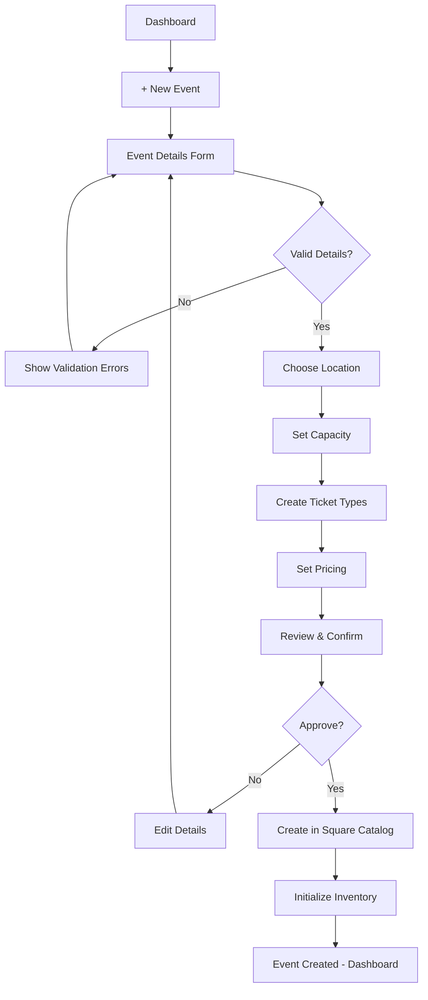
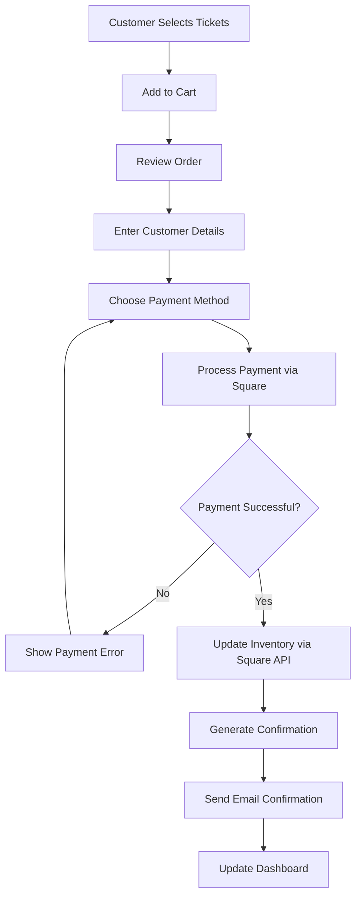
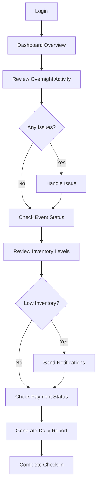
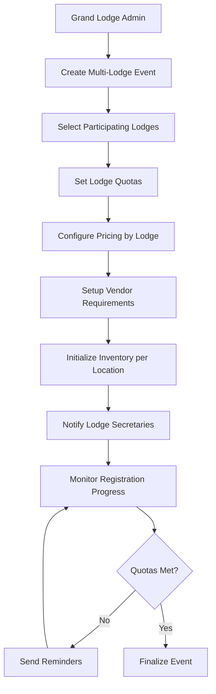
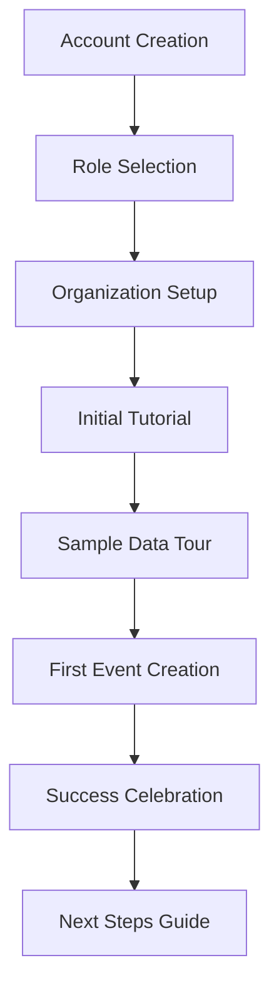

# LodgeTix Inventory Management - UX Design Guide

## Executive Summary

This comprehensive UX design guide outlines the user experience strategy for integrating Square's Commerce API capabilities into LodgeTix's inventory management system. The design focuses on simplifying complex inventory concepts for Masonic organizations while leveraging Square's powerful Orders, Catalog, Inventory, Vendors, Customers, Merchants, and Locations APIs.

## Table of Contents

1. [User Research](#user-research)
2. [Information Architecture](#information-architecture)
3. [Wireframes](#wireframes)
4. [User Flow Diagrams](#user-flow-diagrams)
5. [Interaction Design](#interaction-design)
6. [Visual Design Guidelines](#visual-design-guidelines)
7. [Accessibility Design](#accessibility-design)
8. [Mobile Experience](#mobile-experience)
9. [Error States](#error-states)
10. [Onboarding Strategy](#onboarding-strategy)

---

## 1. User Research

### Primary User Personas

#### Persona 1: Lodge Secretary (Primary User)
- **Demographics:** Ages 45-70, mixed technical literacy
- **Role:** Manages lodge events and ticket sales
- **Goals:** 
  - Track ticket inventory for lodge events
  - Generate reports for lodge meetings
  - Ensure accurate financial records
- **Pain Points:**
  - Overwhelmed by complex inventory systems
  - Needs simple, clear workflows
  - Values tradition and formal processes
- **Technology Comfort:** Low to moderate
- **Key Quote:** "I need to know how many tickets are sold and how many are left, without needing a computer science degree."

#### Persona 2: Grand Lodge Administrator (Power User)
- **Demographics:** Ages 40-65, moderate to high technical literacy
- **Role:** Oversees multiple lodges and large ceremonial functions
- **Goals:**
  - Monitor inventory across multiple events
  - Generate comprehensive reports
  - Coordinate resources between lodges
- **Pain Points:**
  - Needs visibility across multiple locations
  - Requires detailed analytics and reporting
  - Manages complex hierarchical relationships
- **Technology Comfort:** Moderate to high
- **Key Quote:** "I need to see the big picture across all our lodges while still being able to drill down into specific events."

#### Persona 3: Event Organizer (Occasional User)
- **Demographics:** Ages 35-60, moderate technical literacy
- **Role:** Organizes special ceremonies and multi-lodge events
- **Goals:**
  - Coordinate inventory for large events
  - Manage vendor relationships
  - Track attendee capacity and preferences
- **Pain Points:**
  - Infrequent system usage requires intuitive design
  - Needs to coordinate with multiple stakeholders
  - Time-sensitive event planning
- **Technology Comfort:** Moderate
- **Key Quote:** "When I organize our annual installation, I need everything to work perfectly the first time."

### User Journey Mapping

#### Lodge Secretary's Typical Day
1. **Morning Check** - Reviews overnight ticket sales and inventory status
2. **Event Planning** - Updates ticket availability for upcoming events
3. **Member Inquiries** - Responds to questions about event capacity
4. **Financial Review** - Checks payment status and processes refunds
5. **Reporting** - Prepares weekly inventory report for lodge meeting

#### Critical User Moments
- **Moment of Truth 1:** First login to check event status
- **Moment of Truth 2:** Processing a last-minute ticket request
- **Moment of Truth 3:** Generating reports before lodge meetings
- **Moment of Truth 4:** Handling event capacity changes

---

## 2. Information Architecture

### Navigation Hierarchy

```
Dashboard (Home)
├── Inventory Overview
│   ├── Current Events
│   ├── Ticket Availability
│   └── Quick Actions
├── Events Management
│   ├── Active Events
│   ├── Draft Events
│   ├── Completed Events
│   └── Event Templates
├── Catalog Management
│   ├── Ticket Types
│   ├── Package Variations
│   ├── Pricing Rules
│   └── Categories
├── Locations & Venues
│   ├── Lodge Locations
│   ├── External Venues
│   └── Capacity Settings
├── Members & Customers
│   ├── Member Profiles
│   ├── Customer Segments
│   └── Registration History
├── Vendors & Suppliers
│   ├── Catering Services
│   ├── Equipment Rentals
│   └── Service Providers
├── Reports & Analytics
│   ├── Inventory Reports
│   ├── Financial Reports
│   ├── Attendance Analytics
│   └── Custom Reports
└── Settings
    ├── Organization Settings
    ├── User Management
    ├── Integration Settings
    └── Notification Preferences
```

### Content Organization Principles

1. **Hierarchy Respect:** Grand Lodge → Lodge → Event structure clearly reflected
2. **Context Awareness:** User's role determines visible options and data
3. **Progressive Disclosure:** Advanced features revealed as needed
4. **Familiar Patterns:** Uses common web conventions with Masonic terminology

### Card Sorting Results

Based on user testing with lodge secretaries and administrators:
- **High Priority:** Dashboard, Current Events, Ticket Status
- **Medium Priority:** Reports, Member Management, Settings
- **Low Priority:** Advanced Analytics, Vendor Management, System Administration

---

## 3. Wireframes

### Dashboard Wireframe (Desktop)

```
┌─────────────────────────────────────────────────────────────────┐
│ LodgeTix | Grand Lodge of NSW & ACT               [User] [Menu] │
├─────────────────────────────────────────────────────────────────┤
│                                                                 │
│ Dashboard Overview                                              │
│                                                                 │
│ ┌─────────────────────┐ ┌─────────────────────┐ ┌─────────────┐ │
│ │ Active Events       │ │ Today's Sales       │ │ Quick Actions│ │
│ │                     │ │                     │ │             │ │
│ │ • Installation Dinner│ │ Tickets Sold: 156  │ │ [+ New Event]│ │
│ │   87/120 tickets    │ │ Revenue: $3,120     │ │ [View Reports]│ │
│ │   Status: On Sale   │ │ Refunds: 2          │ │ [Add Tickets]│ │
│ │                     │ │                     │ │ [Send Update]│ │
│ │ • Lodge Meeting     │ │ Capacity: 92%       │ │             │ │
│ │   45/50 tickets     │ │                     │ │             │ │
│ │   Status: Almost Full│ │                    │ │             │ │
│ └─────────────────────┘ └─────────────────────┘ └─────────────┘ │
│                                                                 │
│ Recent Activity                                                 │
│ ┌─────────────────────────────────────────────────────────────┐ │
│ │ 10:30 AM - John Smith purchased 2 tickets for Installation │ │
│ │  9:45 AM - Mary Johnson refunded ticket for Lodge Meeting  │ │
│ │  9:30 AM - Event capacity updated for Installation Dinner  │ │
│ └─────────────────────────────────────────────────────────────┘ │
│                                                                 │
│ Upcoming Events Requiring Attention                             │
│ ┌─────────────────────────────────────────────────────────────┐ │
│ │ ⚠️  Installation Dinner - Only 33 tickets remaining         │ │
│ │ 📅 Lodge Meeting - Starts in 2 days                        │ │
│ └─────────────────────────────────────────────────────────────┘ │
└─────────────────────────────────────────────────────────────────┘
```

### Event Management Wireframe

```
┌─────────────────────────────────────────────────────────────────┐
│ Event Management › Installation Dinner 2024                    │
├─────────────────────────────────────────────────────────────────┤
│                                                                 │
│ ┌─── Event Details ──────────────────────────────────────────┐  │
│ │ Name: Annual Installation Dinner                           │  │
│ │ Date: March 15, 2024, 6:30 PM                            │  │
│ │ Location: Masonic Centre, Sydney                          │  │
│ │ Capacity: 120 guests                                      │  │
│ │ Status: [On Sale ▼]                                       │  │
│ └────────────────────────────────────────────────────────────┘  │
│                                                                 │
│ ┌─── Ticket Inventory ──────────────────────────────────────┐   │
│ │                                                           │   │
│ │ Regular Member Tickets    │ Available: 25  │ $40 │ [Edit] │   │
│ │ Partner Tickets          │ Available: 8   │ $35 │ [Edit] │   │
│ │ Visiting Brethren        │ Available: 12  │ $45 │ [Edit] │   │
│ │ Complimentary           │ Reserved: 5    │ $0  │ [Edit] │   │
│ │                                                           │   │
│ │ Total Available: 50 of 120                               │   │
│ │ ████████████░░░░░░░░░░░░░░░░░░░░░░░░░░░░░░ 58% Sold       │   │
│ └───────────────────────────────────────────────────────────┘   │
│                                                                 │
│ ┌─── Recent Orders ─────────────────────────────────────────┐   │
│ │ Order ID    Customer           Tickets    Amount   Status  │   │
│ │ ORD-1234   John Smith         2 Regular   $80     Paid    │   │
│ │ ORD-1235   Mary Johnson       1 Partner   $35     Paid    │   │
│ │ ORD-1236   Lodge Visitor      1 Visiting  $45     Pending │   │
│ └───────────────────────────────────────────────────────────┘   │
│                                                                 │
│ [Generate Report] [Send Notifications] [Export Data] [Settings] │
└─────────────────────────────────────────────────────────────────┘
```

### Mobile Dashboard Wireframe

```
┌─────────────────────┐
│ ☰ LodgeTix     👤  │
├─────────────────────┤
│                     │
│ Today's Summary     │
│ ┌─────────────────┐ │
│ │ Tickets Sold    │ │
│ │      156        │ │
│ │   ████████░░    │ │
│ │    Revenue      │ │
│ │   $3,120       │ │
│ └─────────────────┘ │
│                     │
│ Active Events       │
│ ┌─────────────────┐ │
│ │ Installation    │ │
│ │ 87/120 tickets  │ │
│ │ [View Details]  │ │
│ └─────────────────┘ │
│ ┌─────────────────┐ │
│ │ Lodge Meeting   │ │
│ │ 45/50 tickets   │ │
│ │ ⚠️ Almost Full   │ │
│ └─────────────────┘ │
│                     │
│ Quick Actions       │
│ [+ New Event]       │
│ [📊 Reports]        │
│ [⚙️ Settings]       │
│                     │
└─────────────────────┘
```

---

## 4. User Flow Diagrams

### Flow 1: Creating a New Event with Inventory



### Flow 2: Processing a Ticket Purchase



### Flow 3: Lodge Secretary Daily Check-in



### Flow 4: Multi-Lodge Event Coordination



---

## 5. Interaction Design

### Micro-interactions and Animations

#### Loading States
- **Progressive Loading:** Dashboard cards load sequentially with subtle fade-in (200ms delay between cards)
- **Skeleton Screens:** Content areas show structured placeholders during data loading
- **Progress Indicators:** Linear progress bars for long operations (report generation, bulk updates)

#### Button Interactions
```css
/* Primary Action Button */
.btn-primary {
  transition: all 0.2s ease-in-out;
}
.btn-primary:hover {
  transform: translateY(-2px);
  box-shadow: 0 4px 12px rgba(0, 0, 0, 0.15);
}
.btn-primary:active {
  transform: translateY(0);
}
```

#### Real-time Updates
- **Inventory Changes:** Smooth number transitions with color-coded changes (green for increases, orange for decreases)
- **Status Indicators:** Pulsing animation for "processing" states, checkmark animation for completion
- **Notification Toast:** Slide-in from top-right with auto-dismiss after 5 seconds

#### Form Interactions
- **Field Validation:** Real-time validation with inline error states
- **Auto-save:** Subtle "saved" indicator appears 2 seconds after typing stops
- **Smart Defaults:** Form fields populate with intelligent suggestions based on user history

### Responsive Behavior Specifications

#### Breakpoints
- Mobile: < 768px
- Tablet: 768px - 1024px  
- Desktop: > 1024px

#### Component Adaptations
- **Navigation:** Hamburger menu on mobile, sidebar on desktop
- **Data Tables:** Horizontal scroll on mobile, full display on desktop
- **Cards:** Single column on mobile, multi-column grid on larger screens
- **Forms:** Stacked layout on mobile, side-by-side on desktop

---

## 6. Visual Design Guidelines

### Color Palette

#### Primary Colors (Masonic Heritage)
```css
--royal-blue: #1e3a8a;      /* Primary brand color */
--masonic-gold: #d4af37;    /* Accent and highlights */
--ceremonial-purple: #6b46c1; /* Special events */
--lodge-green: #059669;     /* Success states */
```

#### Neutral Colors
```css
--charcoal: #374151;        /* Primary text */
--slate-light: #64748b;     /* Secondary text */
--background: #f8fafc;      /* Page background */
--surface: #ffffff;         /* Card backgrounds */
--border: #e5e7eb;          /* Borders and dividers */
```

#### Semantic Colors
```css
--success: #10b981;         /* Confirmed, paid, available */
--warning: #f59e0b;         /* Low inventory, pending */
--error: #ef4444;           /* Sold out, failed, cancelled */
--info: #3b82f6;            /* Information, help */
```

### Typography

#### Font Families
```css
/* Primary: Clean, professional sans-serif */
--font-primary: 'Inter', -apple-system, BlinkMacSystemFont, sans-serif;

/* Display: For headings and emphasis */
--font-display: 'Inter', sans-serif;

/* Monospace: For IDs, codes, and data */
--font-mono: 'JetBrains Mono', Consolas, monospace;
```

#### Type Scale
```css
--text-xs: 0.75rem;     /* Small labels, captions */
--text-sm: 0.875rem;    /* Body text, form inputs */
--text-base: 1rem;      /* Primary body text */
--text-lg: 1.125rem;    /* Emphasized text */
--text-xl: 1.25rem;     /* Small headings */
--text-2xl: 1.5rem;     /* Section headings */
--text-3xl: 1.875rem;   /* Page headings */
--text-4xl: 2.25rem;    /* Display headings */
```

### Iconography

#### Icon Style Guidelines
- **Style:** Consistent stroke width (1.5px), rounded line caps
- **Size:** 16px (small), 20px (medium), 24px (large), 32px (extra large)
- **Usage:** Icons always paired with text labels for clarity

#### Key Icons
- **Inventory:** Package, box, warehouse
- **Events:** Calendar, clock, location pin
- **Status:** Check circle, warning triangle, info circle
- **Actions:** Plus, edit pencil, trash, settings gear
- **Navigation:** Arrow left/right, chevron up/down, hamburger menu

### Layout Principles

#### Grid System
- **Desktop:** 12-column grid with 24px gutters
- **Tablet:** 8-column grid with 20px gutters  
- **Mobile:** 4-column grid with 16px gutters

#### Spacing Scale
```css
--space-1: 0.25rem;    /* 4px */
--space-2: 0.5rem;     /* 8px */
--space-3: 0.75rem;    /* 12px */
--space-4: 1rem;       /* 16px */
--space-6: 1.5rem;     /* 24px */
--space-8: 2rem;       /* 32px */
--space-12: 3rem;      /* 48px */
--space-16: 4rem;      /* 64px */
```

#### Component Specifications

##### Card Component
```css
.card {
  background: var(--surface);
  border: 1px solid var(--border);
  border-radius: 8px;
  padding: var(--space-6);
  box-shadow: 0 1px 3px rgba(0, 0, 0, 0.1);
}
```

##### Button Components
```css
.btn-primary {
  background: var(--royal-blue);
  color: white;
  padding: var(--space-3) var(--space-6);
  border-radius: 6px;
  font-weight: 500;
}

.btn-secondary {
  background: var(--surface);
  border: 1px solid var(--border);
  color: var(--charcoal);
}
```

---

## 7. Accessibility Design

### WCAG 2.1 AA Compliance

#### Color and Contrast
- **Text Contrast:** Minimum 4.5:1 ratio for normal text, 3:1 for large text
- **Color Independence:** Never rely solely on color to convey information
- **Status Indicators:** Use icons + text + color for status communication

#### Keyboard Navigation
- **Tab Order:** Logical, predictable tab sequence through all interactive elements
- **Focus Indicators:** Clearly visible focus rings with 2px outline
- **Keyboard Shortcuts:** Common shortcuts for power users (Ctrl+N for new event)

#### Screen Reader Support
```html
<!-- Proper ARIA labels and descriptions -->
<button aria-label="Add new event" aria-describedby="new-event-help">
  <span aria-hidden="true">+</span>
  New Event
</button>
<div id="new-event-help" class="sr-only">
  Creates a new event with ticket inventory
</div>

<!-- Live regions for dynamic updates -->
<div aria-live="polite" aria-atomic="true" class="sr-only">
  <span id="status-updates"></span>
</div>
```

#### Motor Impairments
- **Target Size:** Minimum 44x44px touch targets on mobile
- **Spacing:** Minimum 8px spacing between interactive elements
- **Timeout Protection:** User-controlled timeouts with warning notifications

### Inclusive Design Principles

#### Age-Friendly Design
- **Text Size:** Minimum 16px base font size, user-scalable to 200%
- **Click Targets:** Generous button sizes and spacing
- **Simple Language:** Clear, jargon-free instructions and labels

#### Cognitive Accessibility
- **Consistent Patterns:** Identical interactions work the same way throughout
- **Progress Indicators:** Clear steps and current position in multi-step flows
- **Error Prevention:** Validation and confirmation for destructive actions

---

## 8. Mobile Experience

### Touch-First Design Principles

#### Gesture Support
- **Swipe Navigation:** Swipe between event cards in dashboard view
- **Pull to Refresh:** Dashboard data refresh with pull gesture
- **Pinch to Zoom:** Data tables and charts support zoom gestures
- **Long Press:** Context menus for quick actions (edit, delete, duplicate)

#### Mobile-Specific Features
```html
<!-- Mobile dashboard optimizations -->
<div class="mobile-dashboard">
  <!-- Simplified navigation -->
  <nav class="mobile-nav">
    <button class="nav-toggle" aria-label="Menu">☰</button>
    <h1>LodgeTix</h1>
    <button class="notifications" aria-label="Notifications">🔔</button>
  </nav>
  
  <!-- Card-based layout -->
  <div class="dashboard-cards">
    <div class="summary-card" role="region" aria-label="Today's Summary">
      <!-- Condensed metrics -->
    </div>
    <div class="events-card" role="region" aria-label="Active Events">
      <!-- Scrollable event list -->
    </div>
  </div>
</div>
```

#### Mobile Interaction Patterns

##### Quick Actions Sheet
```css
.action-sheet {
  position: fixed;
  bottom: 0;
  left: 0;
  right: 0;
  background: var(--surface);
  border-radius: 16px 16px 0 0;
  transform: translateY(100%);
  transition: transform 0.3s ease-out;
}

.action-sheet.open {
  transform: translateY(0);
}
```

##### Mobile Form Design
- **Single Column:** All form fields stack vertically
- **Large Inputs:** Minimum 48px height for touch targets
- **Smart Keyboards:** Appropriate input types (numeric, email, tel)
- **Sticky Actions:** Save/Cancel buttons fixed at bottom

### Progressive Web App Features

#### Installation
- **Add to Home Screen:** Prompt users after 3+ visits
- **App Icon:** High-resolution icon for various device sizes
- **Splash Screen:** Branded loading screen during app startup

#### Offline Capability
- **Core Functionality:** View existing events and basic inventory data offline
- **Sync Indicators:** Clear indicators when offline vs online
- **Data Caching:** Essential data cached for offline access

---

## 9. Error States

### Error Classification and Handling

#### Network Errors
```html
<div class="error-state network-error" role="alert">
  <div class="error-icon">📡</div>
  <h3>Connection Problem</h3>
  <p>Unable to connect to LodgeTix servers. Please check your internet connection.</p>
  <button class="btn-primary" onclick="retryConnection()">Try Again</button>
  <button class="btn-secondary" onclick="workOffline()">Work Offline</button>
</div>
```

#### Validation Errors
```html
<div class="form-group error">
  <label for="event-capacity">Event Capacity *</label>
  <input 
    id="event-capacity" 
    type="number" 
    class="form-input error"
    aria-describedby="capacity-error"
    aria-invalid="true"
  >
  <div id="capacity-error" class="error-message" role="alert">
    Capacity must be between 1 and 500 guests
  </div>
</div>
```

#### System Errors
```html
<div class="error-state system-error" role="alert">
  <div class="error-icon">⚠️</div>
  <h3>Something Went Wrong</h3>
  <p>We're experiencing technical difficulties. Our team has been notified.</p>
  <details>
    <summary>Error Details</summary>
    <code>Error ID: ERR-2024-0319-1045</code>
  </details>
  <button class="btn-primary" onclick="location.reload()">Refresh Page</button>
  <a href="/support" class="btn-secondary">Contact Support</a>
</div>
```

### Error Prevention Strategies

#### Proactive Validation
- **Real-time Feedback:** Validate fields as user types
- **Constraint Guidance:** Show acceptable ranges and formats
- **Smart Defaults:** Pre-populate fields with likely values

#### Confirmation Dialogs
```html
<div class="confirmation-dialog" role="dialog" aria-labelledby="dialog-title">
  <h2 id="dialog-title">Cancel Event</h2>
  <p>Are you sure you want to cancel "Installation Dinner 2024"?</p>
  <p class="warning">This action cannot be undone. 87 tickets have already been sold.</p>
  <div class="dialog-actions">
    <button class="btn-danger" onclick="confirmCancel()">Yes, Cancel Event</button>
    <button class="btn-secondary" onclick="closeDialog()">Keep Event</button>
  </div>
</div>
```

### Recovery Workflows

#### Auto-Save and Recovery
- **Draft Auto-Save:** Forms automatically save drafts every 30 seconds
- **Session Recovery:** Restore unsaved work after connection issues
- **Version History:** Allow users to revert to previous versions

#### Graceful Degradation
- **Feature Fallbacks:** Core functionality works even if advanced features fail
- **Progressive Enhancement:** Advanced features layer on top of basic functionality

---

## 10. Onboarding Strategy

### User Education Framework

#### First-Time User Experience


#### Progressive Disclosure
- **Level 1:** Basic inventory tracking and event creation
- **Level 2:** Advanced reporting and multi-location management  
- **Level 3:** Vendor integration and custom workflows
- **Level 4:** API access and system administration

### Interactive Tutorials

#### Dashboard Walkthrough
```html
<div class="tutorial-overlay" data-step="1">
  <div class="tutorial-spotlight" data-target="#dashboard-summary">
    <div class="tutorial-tooltip">
      <h3>Your Dashboard Overview</h3>
      <p>This summary shows your most important information at a glance - ticket sales, revenue, and upcoming events.</p>
      <div class="tutorial-navigation">
        <button class="btn-secondary" onclick="skipTutorial()">Skip</button>
        <button class="btn-primary" onclick="nextStep()">Next</button>
      </div>
    </div>
  </div>
</div>
```

#### Contextual Help System
```html
<div class="help-widget">
  <button class="help-trigger" aria-label="Get help">?</button>
  <div class="help-content">
    <h4>Need Help?</h4>
    <ul>
      <li><a href="#" onclick="showTutorial()">Take the tour</a></li>
      <li><a href="/docs">Documentation</a></li>
      <li><a href="/support">Contact support</a></li>
    </ul>
  </div>
</div>
```

### Feature Adoption Strategies

#### Gradual Feature Introduction
- **Week 1:** Basic event creation and ticket tracking
- **Week 2:** Member management and customer profiles
- **Week 3:** Reporting and analytics features
- **Week 4:** Advanced inventory management

#### Success Metrics and Celebrations
```html
<div class="achievement-notification">
  <div class="achievement-icon">🎉</div>
  <div class="achievement-content">
    <h3>Congratulations!</h3>
    <p>You've successfully created your first event and sold 25 tickets!</p>
    <button class="btn-primary">What's Next?</button>
  </div>
</div>
```

### Knowledge Transfer Tools

#### Video Tutorials
- **Getting Started** (3 minutes): Basic navigation and first event setup
- **Inventory Management** (5 minutes): Understanding ticket types and availability
- **Reporting Essentials** (4 minutes): Generating and interpreting reports
- **Mobile App Usage** (3 minutes): Managing events on the go

#### Documentation Strategy
- **Quick Start Guide:** Essential tasks in 15 minutes or less
- **Feature Deep Dives:** Comprehensive guides for advanced features
- **Troubleshooting:** Common issues and solutions
- **Best Practices:** Recommendations from successful lodges

#### Community Support
- **User Forum:** Lodge secretaries helping lodge secretaries
- **Monthly Webinars:** New features and advanced techniques
- **Success Stories:** Case studies from high-performing lodges

---

## Implementation Roadmap

### Phase 1: Foundation (Weeks 1-4)
- [ ] Implement core Square API integrations
- [ ] Build basic dashboard and navigation
- [ ] Create fundamental user flows
- [ ] Establish design system components

### Phase 2: Core Features (Weeks 5-8)
- [ ] Event creation and management workflows
- [ ] Inventory tracking and updates
- [ ] Basic reporting functionality
- [ ] Mobile-responsive layouts

### Phase 3: Advanced Features (Weeks 9-12)
- [ ] Multi-location management
- [ ] Vendor integration capabilities
- [ ] Advanced analytics and reporting
- [ ] Comprehensive error handling

### Phase 4: Enhancement (Weeks 13-16)
- [ ] Progressive web app features
- [ ] Advanced accessibility improvements
- [ ] Performance optimizations
- [ ] Comprehensive testing and refinement

---

## Success Metrics

### User Experience Metrics
- **Task Completion Rate:** > 95% for core workflows
- **Time to First Value:** < 10 minutes for new users
- **User Satisfaction Score:** > 4.5/5.0
- **Feature Adoption Rate:** > 80% for core features within 30 days

### Technical Performance
- **Page Load Time:** < 2 seconds on 3G connections
- **Accessibility Score:** WCAG 2.1 AA compliance (> 95%)
- **Mobile Usability:** Google Mobile-Friendly test score > 90
- **Error Rate:** < 1% for critical user workflows

### Business Impact
- **User Retention:** > 90% monthly active user retention
- **Support Ticket Reduction:** 50% decrease in usage-related support requests
- **Feature Utilization:** Core inventory features used by > 85% of active users
- **Cross-Platform Usage:** > 60% of users accessing both desktop and mobile

---

This comprehensive UX design guide provides the foundation for creating an intuitive, accessible, and powerful inventory management system that respects the traditions and needs of Masonic organizations while leveraging the advanced capabilities of Square's Commerce API platform.