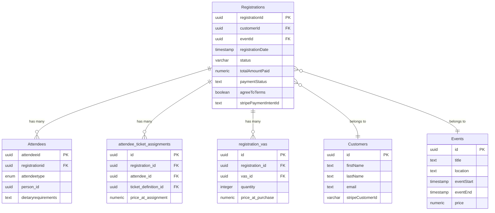

# Registrations Table and Related Tables Documentation

## Overview
The `Registrations` table serves as the central record for event registrations in the system. It tracks who registered (customers), what event they registered for, payment information, and registration status.

## Registrations Table Structure

| Column Name | Data Type | Nullable | Default | Description |
|------------|-----------|----------|---------|-------------|
| registrationId | uuid | NO | - | Primary key - Unique identifier for this registration |
| customerId | uuid | YES | - | Foreign key to Customers table - The customer who made this registration |
| eventId | uuid | YES | - | Foreign key to Events table - The event being registered for |
| registrationDate | timestamp with timezone | YES | - | When the registration was made |
| status | varchar | YES | - | Current status of the registration |
| totalAmountPaid | numeric | YES | - | Total amount paid for this registration |
| totalPricePaid | numeric | YES | - | Total price paid (may differ from amount if there are pending payments) |
| paymentStatus | payment_status (enum) | YES | pending | Status of payment - Options: pending, completed, failed, refunded, partially_refunded, cancelled, expired |
| agreeToTerms | boolean | YES | false | Whether customer agreed to terms and conditions |
| stripePaymentIntentId | text | YES | - | Stripe payment intent identifier for payment processing |
| primaryAttendeeId | uuid | YES | - | Primary attendee for this registration |
| registrationType | registration_type (enum) | YES | - | Type of registration - Options: Individuals, Groups, Officials |
| createdAt | timestamp with timezone | YES | now() | When the record was created |
| updatedAt | timestamp with timezone | YES | now() | When the record was last updated |

## Relationships

### 1. Registrations → Events
**Relationship Type**: Many-to-One  
**Foreign Key**: `Registrations.eventId` → `Events.id`  
**Purpose**: Links a registration to a specific event. Each registration is for one event, but an event can have many registrations.

**Events Table Key Columns**:
- `id` (Primary Key)
- `title` - Event name
- `eventStart`/`eventEnd` - Event timing
- `location` - Event location
- `price` - Event price
- `maxAttendees` - Maximum capacity

### 2. Registrations → Customers
**Relationship Type**: Many-to-One  
**Foreign Key**: `Registrations.customerId` → `Customers.id`  
**Purpose**: Links a registration to the customer who made it. A customer can have multiple registrations.

**Customers Table Key Columns**:
- `id` (Primary Key)
- `firstName`/`lastName` - Customer name
- `email` - Contact email
- `stripeCustomerId` - Stripe customer identifier for payments
- Billing address information
- Contact information

### 3. Attendees → Registrations
**Relationship Type**: Many-to-One  
**Foreign Key**: `Attendees.registrationid` → `Registrations.registrationId`  
**Purpose**: Each registration can have multiple attendees. This allows for group registrations where one customer registers multiple people.

**Attendees Table Key Columns**:
- `attendeeid` (Primary Key)
- `registrationid` - Links to registration
- `attendeetype` - Type (Mason, Guest, LadyPartner, GuestPartner)
- `person_id` - Links to person details
- `dietaryrequirements` - Special dietary needs
- `contactpreference` - How to contact this attendee

### 4. attendee_ticket_assignments → Registrations
**Relationship Type**: Many-to-One  
**Foreign Key**: `attendee_ticket_assignments.registration_id` → `Registrations.registrationId`  
**Purpose**: Tracks which ticket types were assigned to attendees in this registration. Supports multiple ticket types per registration.

**attendee_ticket_assignments Table Key Columns**:
- `id` (Primary Key)
- `registration_id` - Links to registration
- `attendee_id` - Links to specific attendee
- `ticket_definition_id` - Type of ticket assigned
- `price_at_assignment` - Price when ticket was assigned

### 5. registration_vas → Registrations
**Relationship Type**: Many-to-One  
**Foreign Key**: `registration_vas.registration_id` → `Registrations.registrationId`  
**Purpose**: Records Value-Added Services (merchandise, donations, etc.) purchased with this registration.

**registration_vas Table Key Columns**:
- `id` (Primary Key)
- `registration_id` - Links to registration
- `vas_id` - Links to value-added service definition
- `quantity` - Number of items
- `price_at_purchase` - Price when purchased

## Entity Relationship Diagram



## Data Flow

1. **Registration Creation**: A customer selects an event and initiates registration
2. **Customer Association**: The registration is linked to an existing customer or a new customer record is created
3. **Attendee Addition**: One or more attendees are added to the registration
4. **Ticket Assignment**: Appropriate tickets are assigned to each attendee with pricing
5. **Value-Added Services**: Optional merchandise/services are selected and recorded
6. **Payment Processing**: Payment is processed through Stripe and status is updated
7. **Confirmation**: Registration status is finalized and confirmation sent

## Key Business Rules

1. A registration must have exactly one customer and one event
2. A registration can have multiple attendees
3. Each attendee can have multiple ticket assignments (for multi-session events)
4. VAS items are optional but linked to the registration, not individual attendees
5. Payment status tracks the financial state independently of registration status
6. Terms and conditions must be agreed to for valid registration
7. Registration type must be one of: Individuals, Groups, or Officials
8. Payment status must be one of: pending, completed, failed, refunded, partially_refunded, cancelled, or expired

## Common Queries

### Get full registration details
```sql
SELECT 
    r.*,
    c.firstName || ' ' || c.lastName as customerName,
    c.email as customerEmail,
    e.title as eventTitle,
    e.eventStart
FROM Registrations r
JOIN Customers c ON r.customerId = c.id
JOIN Events e ON r.eventId = e.id
WHERE r.registrationId = ?;
```

### Get all attendees for a registration
```sql
SELECT 
    a.*,
    p.givenname || ' ' || p.familyname as attendeeName
FROM Attendees a
LEFT JOIN people p ON a.person_id = p.person_id
WHERE a.registrationid = ?;
```

### Get registration summary with counts
```sql
SELECT 
    r.registrationId,
    COUNT(DISTINCT a.attendeeid) as attendeeCount,
    COUNT(DISTINCT ata.id) as ticketCount,
    COUNT(DISTINCT rv.id) as vasCount,
    r.totalAmountPaid
FROM Registrations r
LEFT JOIN Attendees a ON a.registrationid = r.registrationId
LEFT JOIN attendee_ticket_assignments ata ON ata.registration_id = r.registrationId
LEFT JOIN registration_vas rv ON rv.registration_id = r.registrationId
GROUP BY r.registrationId, r.totalAmountPaid;
```